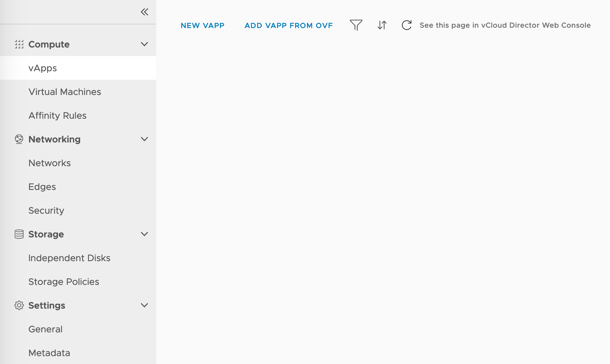
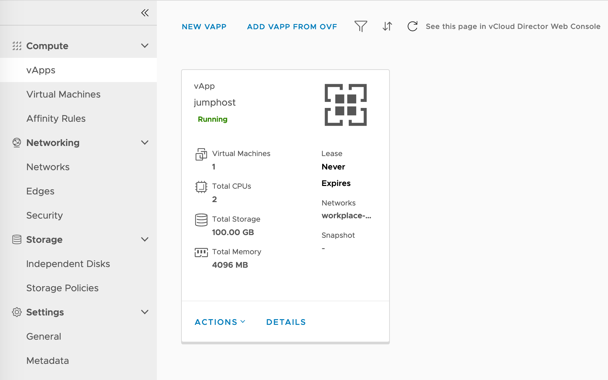
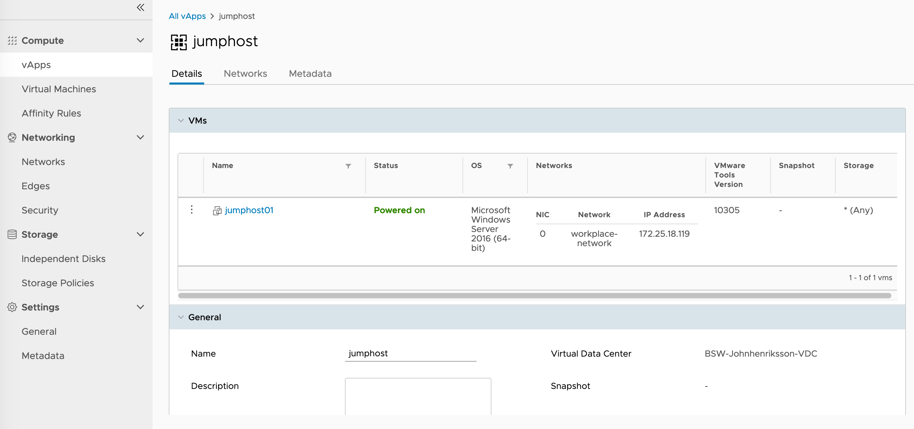

One of the things I enjoy the most in life is to learn new exciting stuff, the part I like the most is how to create. Whether it's in the physical world such as carpentry or homebrewing(I love to brew beer!), or if it's in the virtual computer world where I like to create infrastructure. On the other hand, I also enjoy sharing that knowledge with other people! In this post, I'll share how to create a virtual machine in a software-defined data center(running vCloud Director) with the help of Terraform.

Infrastructure as Code
Let's start by explaining what Infrastructure as Code(often referred to as IaC) is. IaC is like a lifestyle where you choose to define your infrastructure in code. The philosophy is to deploy infrastructure consistently and predictably(and rapidly!). Wikipedia says the following: "The value of IaC can be broken down into three measurable categories: cost (reduction), speed (faster execution) and risk (remove errors and security violations)."

There's a lot of different IaC tools out there in the wild. The main products are Chef, Puppet, Ansible, SaltStack, & Terraform. They all work in different ways, but all hold the IaC philosophy close at heart. I've chosen Terraform as my weapon today because it's open-source, written in Go, and supports all of the major cloud providers, including VMware vSphere(& vCD!).

# Install Terraform

If you've not installed Terraform yet it,s no problem, the installation process is straightforward. Because it's written in Go, all you need is the executable and the correct string in your PATH variable. To make the whole process more comfortable, I use brew on my Mac for this. 

**Mac users:**
```bash
brew install terraform
```


**Other users:**

*I leave it up to you to find out how to install on your system.*

**You need to create these two files:**
* **jumphost.tf**

    I'm creating a VM that will be my jump host in the environment. This file is my base Terraform configuration file.

* **terraform.tfvars**

    This file contains all of my variable data. You should add this to your .gitignore file! This file is private!

**Files created by Terraform:**
* **terraform.tfstate**

    This file is called the state file. The content of this file is the state of your infrastructure. Do not manipulate this file in any way! The state is used to map real-world resources to your configuration.

* **terraform.tfstate.backup**

    Automatic backup of the state file created by the Terraform CLI.

```bash
johnhenriksson@workbook jumphost % tree
.
├── jumphost.tf
├── terraform.tfstate
├── terraform.tfstate.backup
└── terraform.tfvars

0 directories, 4 files
```

# Let's create that config!
Note that these examples are my labs deployed on Konica Minolta's IaaS KMSky. These are just examples, and I've deleted them after this project.

## jumphost.tf

Let's start with the main configuration file. Here I've first declared what variables to use. I then later add the variable data to the .tfvars file. 

To create a VM, I first need to get the network that I want to connect to the VM. I also need to obtain or provision a vApp for this VM. In this example, I get the network but create the vApp. 

```hcl
# variables
variable "vcd_user" {}
variable "vcd_pass" {}
variable "vcd_org" {}
variable "vcd_vdc" {}
variable "vcd_url" {}
variable "vcd_allow_unverified_ssl" {
    default = true
}

# Configure the VMware vCloud Director Provider
provider "vcd" {
  user                 = var.vcd_user
  password             = var.vcd_pass
  org                  = var.vcd_org
  vdc                  = var.vcd_vdc
  url                  = var.vcd_url
  allow_unverified_ssl = var.vcd_allow_unverified_ssl
}

# Get the vcd network as a data source
data "vcd_network_routed" "net" {
  name = "workplace-network"
}

# Create the vApp
resource "vcd_vapp" "jumphost" {
  name = "jumphost"
}

# Create the VM in the vApp
resource "vcd_vapp_vm" "jumphost" {
  vapp_name = vcd_vapp.jumphost.name
  name = "jumphost01"
  catalog_name = "KMsky IAAS Templates - Sweden"
  template_name = "Windows Server 2016 Datacenter - Basic"
  
  computer_name = "jumphost01"
  memory = 4096
  cpus = 2
  cpu_cores = 1

  # Map the network from the data source to the VM
  network {
      name = data.vcd_network_routed.net.name
      type = "org"
      ip = "10.10.0.10"
      ip_allocation_mode = "MANUAL"
      is_primary = true
  }

  depends_on = [vcd_vapp.jumphost]
}
```
## terraform.tfvars
This file is the variable file where you need to specify the details suitable for your environment. You can name the file whatever you like as long as it's file-ending is ".tfvars". Terraform loads all the tfvars files at execution.

```hcl
vcd_user = "username"

vcd_pass = "secretpassword"

vcd_org = "HomelabOrg"

vcd_vdc = "HomelabVDC" 

vcd_url = "https://vcloud.home.lab/api"

vcd_allow_unverified_ssl = true
```
# Run Terraform
The last step is to run the terraform configuration you've created. The steps are simple. You just run the command **terraform apply**, and Terraform then checks the state, prompts for verification, and then pushes the changes.

There is also the option to run the command **terraform plan** to perform a sort of dry-run. The plan command tells you what's about to happen when you apply. This workflow could also be useful in a change management routine where you quickly can provide the changes to your manager.

## Revert changes
Now you've successfully applied some new infrastructure with the help of code, congratulations! But, how do I perform lifecycle management on this infrastructure? When it's time for the app to be decommissioned and the infrastructure to be removed, how do you do that? Well. Lucky for you! Terraform has a command to remove the resources you've created. To remove the resources, run the command **terraform destroy**, and everything is as it was before you created the environment.

## Video
I'll include a simple video of me running the **terraform apply** command.
`youtube: https://www.youtube.com/watch?v=3TSa0cSpF1o`

## Screenshots
**Empty vCloud Tenant DC - Before Terraform**

**vApp Created from Terraform**

**VM inside vApp created from Terraform**



