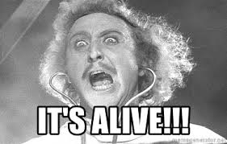

I followed Dave Ceddias awesome guide on how to get a Gatsbyjs blog up and running, [you'll find the guide here](https://daveceddia.com/start-blog-gatsby-netlify/).

My requirements was a minimal blog that was easy to manage. I needed to be able to write in markup syntax and have code higlighting.

Gatsbyjs is really aweseom, it lets med do all that and is lightning fast!

Wish me good luck!

