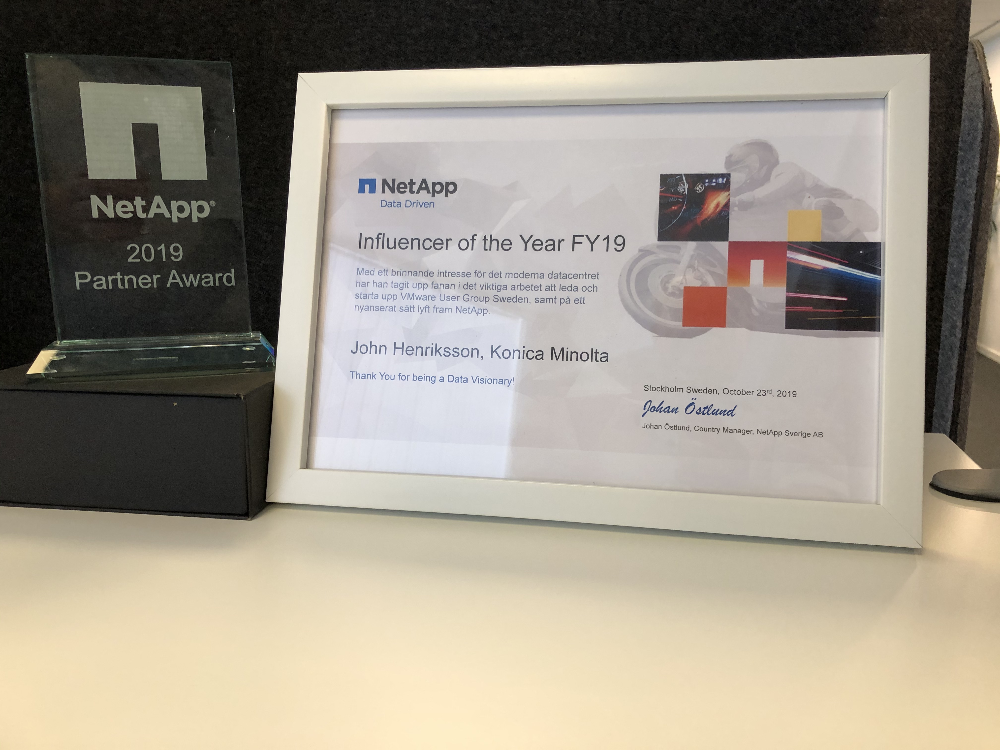

A couple of days ago, the yearly NetApp partner event in Sweden took place. When I got the invitation, I immediately accepted. But, days before, my kids got both chicken-pox and otitis at the same time, I was forced to cancel. 

The day after the event took place, I got an email from one of the organizers that I did win the "Influencer of the Year"-award.

Although I'm regretful that I couldn't attend, I'm incredibly grateful to be recognized for my efforts! I did not expect to win a prize of any kind, so I'm still in chock.

The motivation for the award was something like this(translated from Swedish):

"With a strong interest in the modern data center, he has taken up the flag in the important work of leading and launching the VMware User Group Sweden, and in a nuanced way, highlight NetApp."

