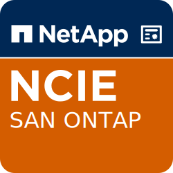

I've stepped out of the certification room, super excited to have passed the NS0-509 exam. It was a challenge! I did pass the NCSA (NS0-160) exam before the summer, so I had some experience in how the NetApp certification program works. I'll share my experience with the NS0-509 exam in this blog post.

Let me give you some background about myself. I started working with storage in about 2015 as a VMware admin. We had an older VMware cluster running iSCSI with HP LeftHand arrays. But, we got the task to install a new VMware-environment running DELL hardware exclusively. As a new VMware admin, it was a challenge to bring up everything, including networking, compute, and storage. Eventually, we sorted everything out and had a VMware cluster running with iSCSI storage. 

About a year ago, I stumbled on to NetApp storage. I worked with a project for approx three months as a NetApp admin. The environment consisted of a stretched VMware cluster with NetApp arrays in MetroCluster configuration. After this, I have a real taste for learning NetApp.  

So, enough with the jibber-jabber. The NS0-509 exam is created to prove that you have enough knowledge to implement, troubleshoot, and maintain a SAN environment.  It has nothing to do with data protection. There is a dedicated certification path just for that.

Sometimes the sentences were a bit tricky, and it felt that they tried to trick you into answering with a wrong answer. But, overall, I thought that the questions were right, challenging, and evenly spread over the subject areas. You need to have a good understanding of SAN infrastructure to pass this exam. The most important things are multipathing, zoning, port specifications, and compatibility. 

The things that stood out in this version of the NCIE exam is the NVMe over fabrics protocol. You need to prepare for that and have knowledge of how namespaces, subsystem, NQN, and ANA works.

The NetApp tools you need to study are (and not exclusively) OneCollect, IMT, HWU, Host Utilities, ActiveIQ, and Config Advisor.

Overall, I'm satisfied with the questions and the exam. Here's a list of resources for you to study if you're planning to take the NS0-509 exam.

[whydoyoulikewafls blog post about FC zoning](https://whydoyoulikewafls.wordpress.com/2019/07/31/zoning-for-cluster-storage-in-pictures/)

[NetApp Learning Center - ONTAP SAN Fundamentals](http://learningcenter.netapp.com/LC?ObjectType=Course&ObjectID=STRSW-WBT-SANFUND-REV01)

[NetApp Exam Preperation Guide](https://www.netapp.com/us/services-support/university/certification/ncie-san.aspx#prepare_your_exam)

