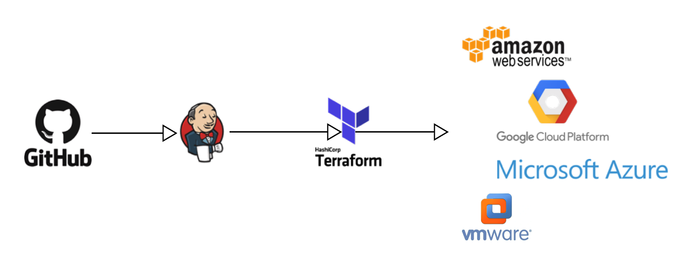

My Terraform adventures continue! In my last post, I covered how to provision a VM on vCloud Director with the help of Terraform. I'm just at the beginning of my IaC journey, but I already see the benefits of using this method to deploy infrastructure. The main advantage of using IaC is that you easily can re-use the code on multiple similar projects.  When you start a new project, it's just a matter of copying your codebase and modifying it to fit the current project. Other advantages are documentation in code, ability to have CI/CD pipeline that ties into a managed change process with approvals. 



In this post, I'll show you how to use terraform code to open ports in the vCloud Director tenant Edge. In the vCloud Edge, you need to both open the port in the firewall and create the correct NAT rule to translate the external IP to the internal one. In this example, I need to open several ports, so I'll create a list object and loop over it in the code. Let's get started!

This post will focus primarily on the code to deploy resources, firewall & NAT-rules. I will not go into the depth of how to get started with terraform or how terraform works. I've already written a post on that.

Below you'll find the code we use:
```hcl
# variables declared in tfvars-file
variable "vcd_user" {}
variable "vcd_pass" {}
variable "vcd_org" {}
variable "vcd_vdc" {}
variable "vcd_url" {}
variable "network_name" {}
variable "ext_network_name" {}
variable "edge_name" {}
variable "vcd_allow_unverified_ssl" {
    default = true
}

# Create the list of ports to open
variable "ports" {
  type = list(string)
  default = ["443", "80", "25", "587", "995", "110", "465", "143", "993"]
}

# Configure the VMware vCloud Director Provider
provider "vcd" {
  user                 = var.vcd_user
  password             = var.vcd_pass
  org                  = var.vcd_org
  vdc                  = var.vcd_vdc
  url                  = var.vcd_url
  allow_unverified_ssl = var.vcd_allow_unverified_ssl
}

# Create the firewall rules
resource "vcd_nsxv_firewall_rule" "rules-ports" {
  for_each = toset(var.ports)
  edge_gateway = var.edge_name
  
  name = "mailsrv01 allow ${each.value} in"
  source {
    ip_addresses = ["any"]
  }

  destination {
    ip_addresses = ["207.234.154.120"]
  }

  service {
    protocol = "tcp"
    port = each.value
  }
}

# create the NAT-rules
resource "vcd_nsxv_dnat" "nat-ports" {
  for_each = toset(var.ports)

  edge_gateway = var.edge_name
  network_type = "ext"
  network_name = var.ext_network_name

  original_address   = "207.234.154.120"
  original_port = each.value

  translated_address = "10.23.44.16"
  translated_port = each.value

  protocol = "tcp"

}
```
To deploy the infrastructure, you should use the terraform workflow, as usual, init, validate, plan, apply. I'll now go over the different script blocks to explain what is happening.

We create a list of strings, and this is all our port numbers to open. Later on, we will loop over this variable to create multiple rules.

```hcl
variable "ports" {
  type = list(string)
  default = ["443", "80", "25", "587", "995", "110", "465", "143", "993"]
}
```

Here we create the resource of type firewall rule, and the one thing you may see differs from a usual block of this resource type is the for\_each line. The only thing you need to think about is that for\_each only takes a set variable as a parameter, so we need to transform the list of strings into a set. 

When we have all this in place, Terraform creates one resource for each value in the list. You access the value in the loop by the each.value variable. We do the same for the NAT-rule resource creation.

```hcl
resource "vcd_nsxv_firewall_rule" "rules-ports" {
  for_each = toset(var.ports)
  edge_gateway = var.edge_name
  
  name = "mailsrv01 allow ${each.value} in"
  source {
    ip_addresses = ["any"]
  }

  destination {
    ip_addresses = ["207.234.154.120"]
  }

  service {
    protocol = "tcp"
    port = each.value
  }
}
```