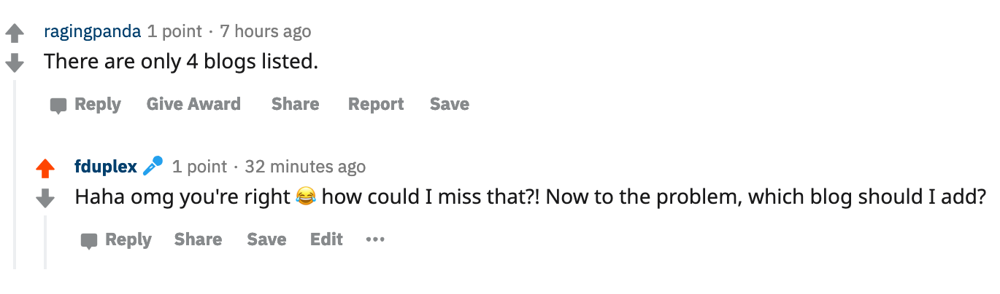

If you're like me, eager to learn and absorb all of the knowledge, you need to have a couple of useful blogs to follow. In this post, I list 5 of my favorite NetApp blogs that I follow regularly.

# [IOPS.ca](https://blog.iops.ca/ "IOPS.ca")

This blog by Chris Maki is easy to consume with it's relatively short and relevant posts. This blog focus on NetApp products and features.

# [Why do you like WAFLs?](https://whydoyoulikewafls.wordpress.com/ "Why do you like WAFLs?")

This blog is, in my opinion, the best place to learn fundamental concepts of SAN, NAS & ONTAP. I used this blog as preparation for both my NCDA & NCIE exam. 

# [thePub](https://netapp.io/blog/ "thePub")

The one-stop for DevOps stuff! It covers Kubernetes, Trident & Automation. This blog should be your home page if you're working as a NetApp DevOps. 

# [WHY IS THE INTERNET BROKEN?](https://whyistheinternetbroken.wordpress.com/ "WHY IS THE INTERNET BROKEN?")

Home of the famous podcast! Besides the pod-updates, the posts are interesting, and often we see sneak peeks from features to come. 

# EDIT 2019-11-11

I'm honestly quite embarrassed. After posting a link to this post on [Reddit](https://www.reddit.com/r/netapp/comments/du9c3f/new_blog_post_top_5_netapp_blogs_to_follow_in_2019/), one excellent user, ragingpanda, made me aware that I only listed 4, not 5 links in this post. 

This issue is certainly something we need to correct! I did get some extra tips in the Reddit post as well, so I'll make it easy for myself, I'll list the blog sites below. If you got some other NetApp blog, I shouldn't miss, or you feel it should be on this list, hit me up in the comments below!

## [DerScmitz.com](http://derschmitz.com/en/ "DerScmitz.com")

## [Words of Steiner](https://words.ofsteiner.com/ "Words of Steine")