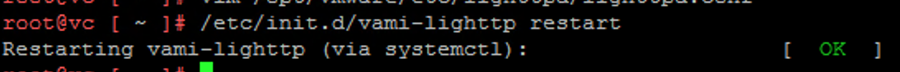

When you've configured your vCenter Server Appliance to be a subordinate certificate authority, the VAMI interface at https://vcenter:5480 doesn't use the new certificate, and it uses a self-signed certificate. In this post, I show you how to resolve this.

First, SSH into the vCSA and locate the certificate file you signed at your CA for the vCSA appliance, it should be named something like vmca.crt or vmca.cer. 

Copy and rename that file:

```bash
cp vmca.cer /etc/applmgmt/appliance/vmca.crt
```

Open the configuration file:

```bash
vim /opt/vmware/etc/lighttpd/lighttpd.conf
```

Add this line at the bottom of the file: 

```bash
ssl.ca-file = "/etc/applmgmt/appliance/vmca.crt"
```

Restart the HTTP service:

```bash
/etc/init.d/vami-lighttp restart
```

It should look like this if successful:



Now when you browse to the https://vcenter:5480, the certificate is valid and trusted.