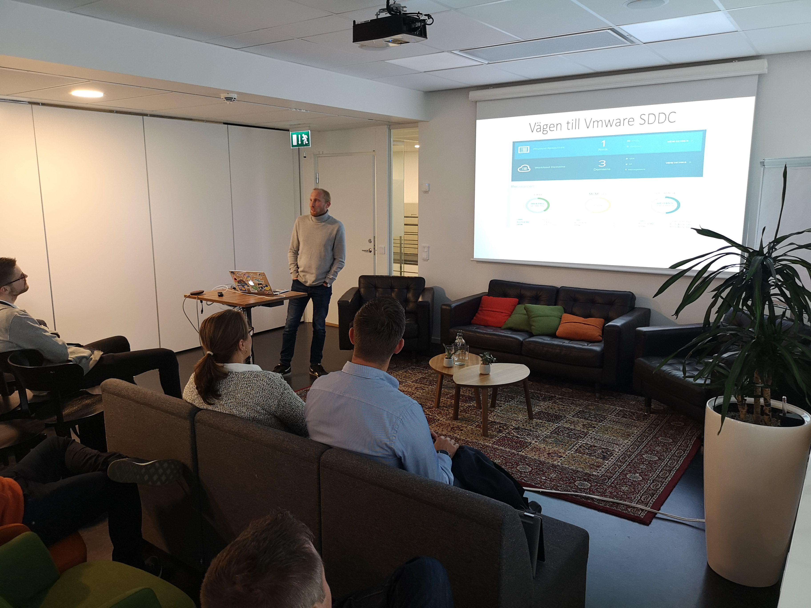
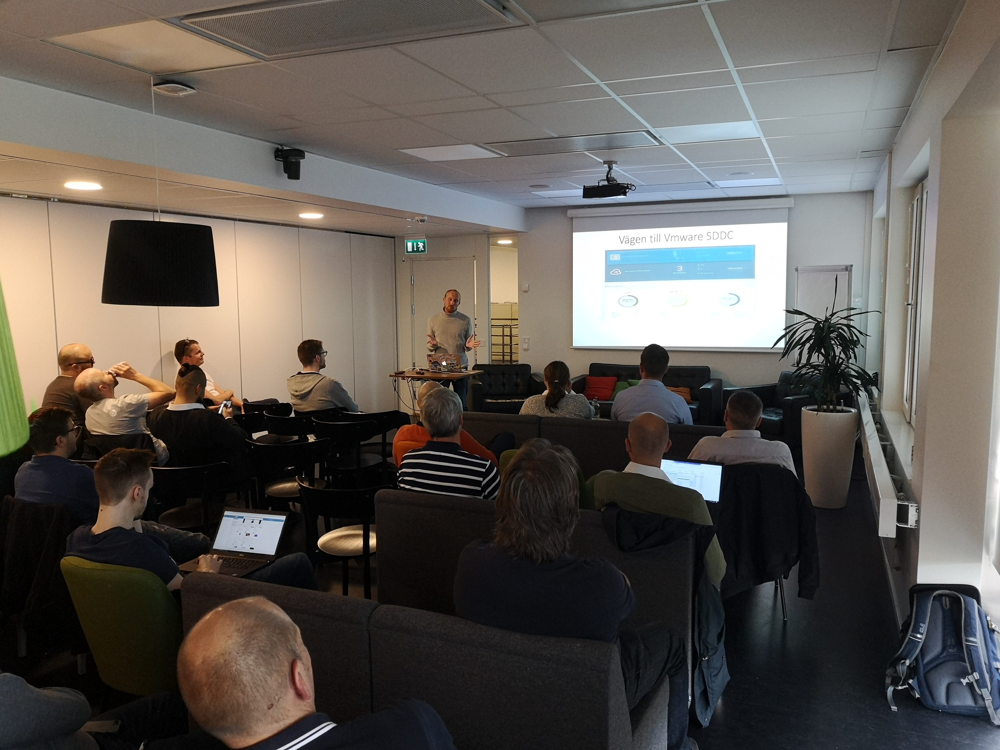
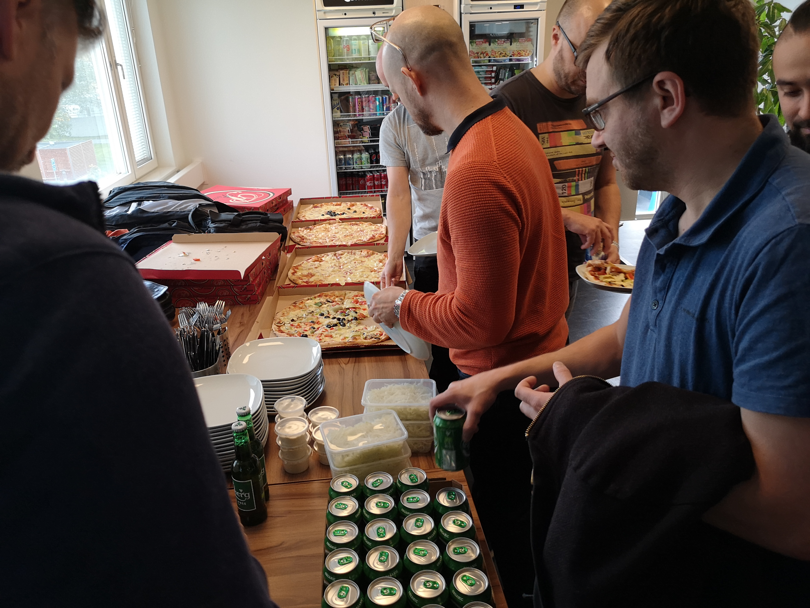
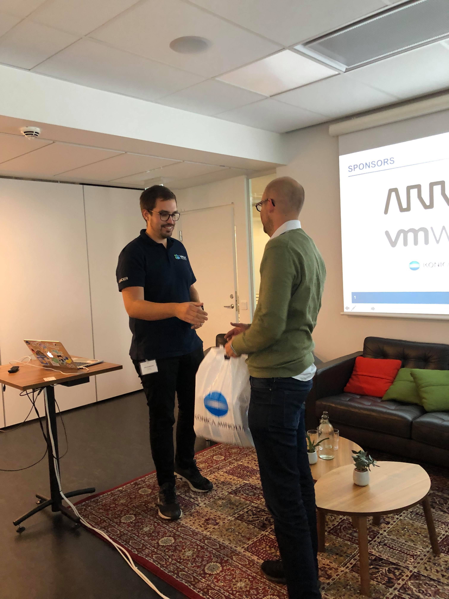

First of all, I would like to thank everyone that attended our first VMUG event in Sweden. Also, a BIG thank you to our sponsors! 

At first, I was troubled that everyone would be no-shows. Then, I got overwhelmed at how many that showed up! When we had our first meeting planning the event, we had a plan and conference room for about ten people, but we were roughly 35 attendees!

The first of the two sessions were speakers from VMware. They did an excellent presentation on all of the news from VMworld US. Mainly, the first session focused on VMware Tanzu and Project Pacific. 

The second and last session was Pontus from Region Uppsala(Swedish healthcare region). He also did an exceptional presentation! He presented on their project, going from Hyper-V to VMware Cloud Foundation in less than a year. The main goal of the entire project from the start was to automate and provide self-service to the internal application owners. It quickly became much more than that, and they replaced the legacy converged infrastructure to modern hyper-converged vxRail systems. It was a fascinating story!

Lastly, VMware got us some pizza and beer! I met a bunch of new people that are facing the same daily challenges as me. The people in the VMware community are great! Hopefully, we will have another event soon!  And, please let me know what you would've liked to hear about next time! Send an email to sweden@vmug.com with your thoughts and ideas.

On a different note, I started this morning strong! I successfully renewed my VCP-DCV certification. This time I did the delta exam, consisting of 40 questions over 75 minutes. The exam was challenging in many areas, but I enjoyed the experience! I highly recommend that you renew your certification if you haven't had the time yet.

Here are some pictures from the event:

