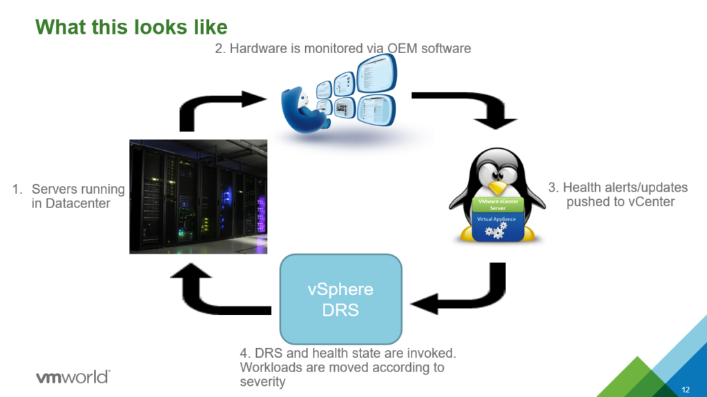

You are a VMware Administrator. In your data center, there's a vSphere 6.0 cluster running rock-solid! But, with the 6.0 end of support coming up March 12, 2020, you're forced to look into the newer version of vSphere. You may have noticed that there's been a couple of improvements and new features since 6.0 came out. In this post, I'll walk you through the feature called Proactive HA, released in 6.5.

In short, Proactive HA is and extension of DRS that uses the vendor Health Provider to move VM's off degraded hosts. You may think, but why?? Why does it have HA in the name if it's not part of vSphere HA?! Well, it is not part of the vSphere HA architecture, and I'll explain the difference. But, you do enable and configure it in the same GUI window as vSphere HA.

There are a couple of different states reported from the health provider, and it's up to you as an admin to configure the responses. The severity levels are; Healthy, Moderate Degradation, Severe Degradation, and Unkown. I'll jump directly to the recommended actions, and they are, Quarantine mode for Moderate and Maintenance mode for severe failure.  In reality, the moderate state could be that one of ten fans failed, and the severe level could be a critical memory error. 

**Quarantine mode** is where no new VM's are allowed to run on the host, but the ones running will be allowed to stay on the host if the cluster resources are overcommitted.

**Maintenance mode** is straightforward. All VM's will be moved off the host.

##To enable Proactive HA, you need the following:
* vCenter Server & ESXi 6.5 or above
* Enterprise Plus or Platinum license
* Supported **Health Provider plugin** from your hardware vendor

The licensing is straight forward, but what the heck is **"Health Provider plugin"** ?! It's the hardest part with Proactive HA. The plugin is the middle-man between the hardware layer and vCenter. **The plugin is hard to find from most hardware providers.** *I advise you to reach out to your hardware vendor or partner.*

##Steps to enable Proactive HA:

* Edit **"vSphere Availability"** on the cluster
* Select **"Turn on Proactive HA"**
* Click  **"Proactive HA Failures and Responses"**
* Modify the settings to:
    * **Automation Level:** Automated
    * **Remediation:** Quarantine mode for moderate and Maintenance mode for severe failure (Mixed).