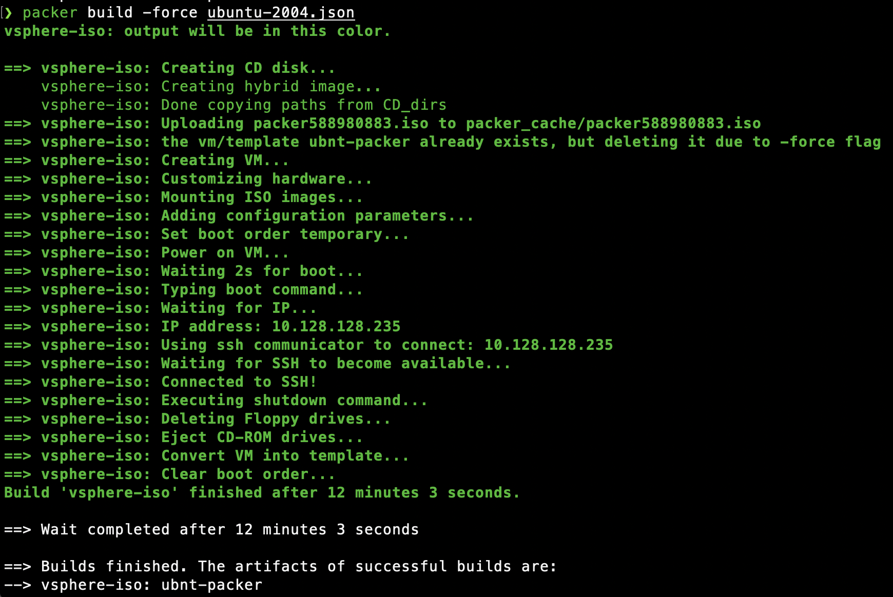
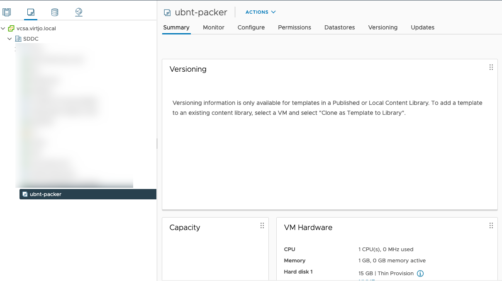

I have a home lab in my basement for learning purposes and to be able to create useful content on this blog. My next mission is to learn more about Kubernetes and advance my knowledge of IaC and Linux. For this, I need a consistent way to build and deploy Ubuntu VM's. In this post, I'll show you how I use Packer to create VM templates on vSphere.


# What is Packer?
Let's hear it from the source:

*Packer is an open-source tool for creating identical machine images for multiple platforms from a single source configuration. Packer is lightweight, runs on every major operating system, and is highly performant, creating machine images for multiple platforms in parallel. Packer does not replace configuration management like Chef or Puppet. In fact, when building images, Packer is able to use tools like Chef or Puppet to install software onto the image.*

[packer.io](https://www.packer.io/intro)

So basically, you can use Packer to build VM's from ISO's based on code. Infrastructure as code, just how we like it. Also, it's easy to implement in your CI/CD pipeline to go full hipster.

Packer builds the VM from the desired ISO and is also able to perform advanced provision tasks. Also, I'm able to inject my SSH public key to enable key-based authentication on the template.

I'll later use this VM template as a source when deploying infrastructure resources with Terraform, but more on that in another blog post.

# Install Packer

I will not go through the installation process in this blog. Please visit the getting started guide on packer.io if you need help installing. [You'll find it here.](https://learn.hashicorp.com/tutorials/packer/getting-started-install)

# Create the Build
In my home lab, I'm now able to build a fresh template in ~12 minutes. That's pretty good!

You'll need these files. The .json file is where you configure settings for Packer to build and provision the VM, connect to vSphere, and so on. The user-data and meta-data files are used for unattended installation of Ubuntu. Although only the user-data files contain information, both must be present. Packer uses these files and mounts them as CDROM's to the vSphere guest VM.


```bash
❯ tree .
.
├── http
│   ├── meta-data
│   └── user-data
└── ubuntu-2004.json
```


Also, you'll need to upload an ISO to the vSphere datastore and edit the iso_url variable. I've uploaded the ISO to my NVME datastore, as you see here.

[Download Ubuntu Server ISO](https://releases.ubuntu.com/20.10/ubuntu-20.10-live-server-amd64.iso)
```json
"iso_url": "[NVME] ISO/ubuntu-20.04.1-live-server-amd64(1).iso"
```

## Important code snippets in the build file

### SSH Timeout

So, I had some trouble with Packer where it failed to connect to SSH. The issue is that SSH is present when Ubuntu performs the unattended installation, then Ubuntu reboots and performs the cloud-init part and configures my user. Packer thinks the VM is ready on the first SSH connectivity.

Be sure to add this snippet to workaround the issue.
```json
"ssh_timeout": "20m",
"ssh_handshake_attempts": "100",
```

### Generate Password

You need to generate a password salted with SHA512. Unfortnaetly I faced some issues with my Mac where mkpasswd is not present. Well, docker to the rescue! The below command works fine to generate the password with the help of docker.

```bash
> docker run --rm -ti alpine:latest mkpasswd -m sha512
Password: 
$6$eZsKuZ3lwrfwvrJ3$FSmB.RPl9doTTe57fHDvbMjyu/wFZOcNfuGZ82id4ZZYbUZ0P9GP6ZWamYK3JZzwnMIjL1WEVczqHf03.IqYS/
```

### Configure Identity

Edit the user-data file with the newly created password.

```yaml
#user-data
identity:
  hostname: ubuntu-packer
  username: ubnt
  password: $6$RAVeOPg.9rJylcnK$tm6KVpRXxTGb0et.1PQcmLVCFLjIVaLye.Weiizxw3ecGRI2kA0JH7nFxkJCz4oeZphSO4qzYSwncE/s34UHg0
```

### SSH Settings

First, you'll need your SSH public key if you want to enable key-based authentication in your template.

```bash
❯ cat ~/.ssh/id_rsa.pub
ssh-rsa AAAAB3NzaC1yc2EAAAADAQABAAABAQCi9eAu6KBaShdcL4pxi6/sJp+IS6nCKexcjQdwFLxg+EoiT2MTAnMsjnfi570het+VV+iOigcZLuRwEcAPh6rSQOtpikmpV6WFjzToWq9aUxDrxWsp/iEPHp+sbjrlsdnGvLGY9XhmPs9s5I8xFQbwF6ilhMIQm+RxtGJJuPUWaF+uXo+3CB91A6bK/rjs97iAjrPZRs0vo5hJGqrIGFi3WP9hf8hF9oWz2BiLRYBib3il6lsAl4Ca0sI//gNM0Ztj4gB7qv1+uPz157bk0IZoN285/72l/rUZVSPIwO+QFZFK07FsyVrpAgMlHk65BiSAO4DtolZEArfXRE1g1DH/ mail@example.com
```

Secondly, inject the key in the user-data file.
```yaml
#user-data
ssh:
  install-server: yes
  allow-pw: true
  authorized-keys: 
    - ssh-rsa AAAAB3NzaC1yc2EAAAADAQABAAABAQCi9eAu6KBaShdcL4pxi6/sJp+IS6nCKexcjQdwFLxg+EoiT2MTAnMsjnfi570het+VV+iOigcZLuRwEcAPh6rSQOtpikmpV6WFjzToWq9aUxDrxWsp/iEPHp+sbjrlsdnGvLGY9XhmPs9s5I8xFQbwF6ilhMIQm+RxtGJJuPUWaF+uXo+3CB91A6bK/rjs97iAjrPZRs0vo5hJGqrIGFi3WP9hf8hF9oWz2BiLRYBib3il6lsAl4Ca0sI//gNM0Ztj4gB7qv1+uPz157bk0IZoN285/72l/rUZVSPIwO+QFZFK07FsyVrpAgMlHk65BiSAO4DtolZEArfXRE1g1DH/ mail@example.com
```

### Build

When you've created the required files and filled in all the variables, you're ready to build the VM. Use the below command to start the build. If you're overwriting the VM with each iteration, use the -force flag.

```bash
> packer build -force ubuntu-2004.json
```



When you're done, you'll find the template in vSphere ready for use!


# Required Files
**ubuntu-2004.json**
```json
{
    
  "variables": {    
    "vsphere-server": "vcsa.virtjo.local",
    "vsphere-user": "administrator@vsphere.local",
    "vsphere-password": "SuperSecurePassword",
    "vsphere-datacenter": "SDDC",    
    "vsphere-cluster": "esxi01.virtjo.local",    
    "vsphere-network": "VLAN128",
    "vsphere-datastore": "NVME",        
    "vm-name": "ubnt-packer",
    "vm-cpu-num": "1",
    "vm-mem-size": "1024",
    "vm-disk-size": "25600",    
    "iso_url": "[NVME] ISO/ubuntu-20.04.1-live-server-amd64(1).iso"  
  },
  "builders": [
    {
      "type": "vsphere-iso",
      "vcenter_server": "{{user `vsphere-server`}}",      
      "username": "{{user `vsphere-user`}}",      
      "password": "{{user `vsphere-password`}}",
      "insecure_connection": "true",
    
      "datacenter": "{{user `vsphere-datacenter`}}",
      "cluster": "{{user `vsphere-cluster`}}",      
          

      "datastore": "{{user `vsphere-datastore`}}",  
      "guest_os_type": "ubuntu64Guest",
      "CPUs": 1,
      "RAM": 1024,
      "RAM_reserve_all": false,
      "disk_controller_type": "pvscsi",
      "storage": {
        "disk_size": 15000,
        "disk_thin_provisioned":true
      },
      "network_adapters": {
        "network": "{{user `vsphere-network`}}", 
        "network_card": "vmxnet3"
      },

      "vm_name": "{{user `vm-name`}}",      
      "notes": "Build via Packer",            
      "convert_to_template": true,

      "ssh_username": "ubnt",      
      "ssh_password": "ubnt",
      "ssh_timeout": "20m",
      "ssh_handshake_attempts": "100",

      "iso_paths": ["{{user `iso_url`}}"], 

      "cd_files": ["./http/user-data", "./http/meta-data"],
      "cd_label": "cidata",
      "boot_wait": "2s",
      "boot_command": [
        "<enter><wait2><enter><wait><f6><esc><wait>",
        " autoinstall<wait2> ds=nocloud;",
        "<wait><enter>"
      ],
      "shutdown_command": "echo 'ubnt'|sudo -S shutdown -P now" 
    }
  ]
}
```

**user-data**
```yaml
#cloud-config
autoinstall:
  version: 1
  locale: en_US
  keyboard:
    layout: en
    variant: us
  network:
    network:
      version: 2
      ethernets:
        ens192:
          dhcp4: true
  storage:
    layout:
      name: lvm
  identity:
    hostname: ubuntu-packer
    username: ubnt
    password: $6$RAVeOPg.9rJylcnK$tm6KVpRXxTGb0et.1PQcmLVCFLjIVaLye.Weiizxw3ecGRI2kA0JH7nFxkJCz4oeZphSO4qzYSwncE/s34UHg0
  ssh:
    install-server: yes
    allow-pw: true
    authorized-keys: 
      - ssh-rsa AAAAB3NzaC1yc2EAAAADAQABAAABAQCi9eAu6KBaShdcL4pxi6/sJp+IS6nCKexcjQdwFLxg+EoiT2MTAnMsjnfi570het+VV+iOigcZLuRwEcAPh6rSQOtpikmpV6WFjzToWq9aUxDrxWsp/iEPHp+sbjrlsdnGvLGY9XhmPs9s5I8xFQbwF6ilhMIQm+RxtGJJuPUWaF+uXo+3CB91A6bK/rjs97iAjrPZRs0vo5hJGqrIGFi3WP9hf8hF9oWz2BiLRYBib3il6lsAl4Ca0sI//gNM0Ztj4gB7qv1+uPz157bk0IZoN285/72l/rUZVSPIwO+QFZFK07FsyVrpAgMlHk65BiSAO4DtolZEArfXRE1g1DH/ mail@example.com
  user-data:
    disable_root: false
  late-commands:
    - echo 'ubnt ALL=(ALL) NOPASSWD:ALL' > /target/etc/sudoers.d/ubuntu
```

