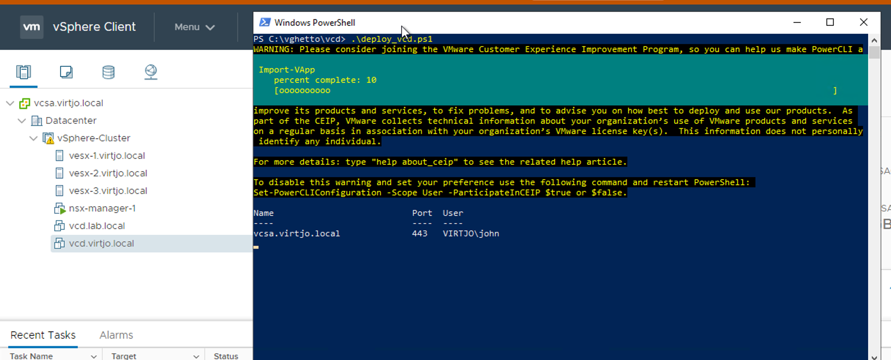

In my home lab, I like to automate as much as possible so I can bring stuff up/down quickly. To achieve this I use several tools such as Ansible, Terraform and PowerShell. This time I decided on using PowerShell to quickly bring up VCD with the same settings every time.

This script deploys the appliance and please, edit the settings to fit your environment. 

First, you need to download the VCD Appliance 10.1.1 and point the **$ovfPath** variable to the .ova file.

Then, adjust the rest of the variables to fit your environment.

Finally, run the script! Should look something like this,



Below, you'll find the full code.

```powershell
$viserver = "vcsa.lab.local"
$ovfPath = ".\VMware_Cloud_Director-10.1.1.4916-16288798_OVF10.ova"
$clusterName = "vSphere-Cluster"
$datastoreName = "vsanDatastore"
$VMName = "vcd.lab.local"
$secretPassword = "P@ssw0rd"
$adminEmail = "admin@lab.local"

$networkPortGroup = "sddc-network"
$networkGateway = "192.168.10.1"
$networkNetmask = "255.255.255.0"
$networkVCDAddress1 = "192.168.10.50"
$networkVCDAddress2 = "192.168.10.51"
$networkNTPServer = "192.168.10.40"
$networkDNSServer = "192.168.10.40"
$searchDomain = "lab.local"
$NFSMount = "192.168.10.45:/mnt/nfsexport"


Connect-VIServer $viserver

# VMware Resources
$Cluster = Get-Cluster -Name $clusterName
$VMHost = Get-Cluster $Cluster | Get-VMHost | Select -First 1
$Datastore = Get-Datastore -Name $datastoreName
$DiskFormat = "Thin"


$ovfConfig = Get-OvfConfiguration -Ovf $ovfPath

# ======================================================================
# OvfConfiguration: VMware_Cloud_Director-10.1.1.4916-16288798_OVF10.ova

#    Properties:
#    -----------
#    DeploymentOption
#    IpAssignment
#    NetworkMapping
#    vami
#    vcloudapp
#    vcloudconf
#    vcloudnet

## --- OVF Configuration

$ovfConfig.DeploymentOption.Value = "primary-small"

# Network mapping
$ovfConfig.NetworkMapping.eth0_Network.Value = $networkPortGroup
$ovfConfig.NetworkMapping.eth1_Network.Value = $networkPortGroup

# Network Configuration
$ovfConfig.IpAssignment.IpProtocol.Value = "IPv4"
$ovfConfig.vami.VMware_vCloud_Director.gateway.Value = $networkGateway
$ovfConfig.vami.VMware_vCloud_Director.domain.Value = $VMName
$ovfConfig.vami.VMware_vCloud_Director.searchpath.Value = $searchDomain
$ovfConfig.vami.VMware_vCloud_Director.DNS.Value = $networkDNSServer
$ovfConfig.vami.VMware_vCloud_Director.ip0.Value = $networkVCDAddress1
$ovfConfig.vami.VMware_vCloud_Director.netmask0.Value = $networkNetmask
$ovfConfig.vami.VMware_vCloud_Director.ip1.Value = $networkVCDAddress2
$ovfConfig.vami.VMware_vCloud_Director.netmask1.Value = $networkNetmask

# vCloud App Settings
$ovfConfig.vcloudapp.VMware_vCloud_Director.ntp_server.Value = $networkNTPServer
$ovfConfig.vcloudapp.VMware_vCloud_Director.varoot_password.Value = $secretPassword
$ovfConfig.vcloudapp.VMware_vCloud_Director.expire_root_password.Value = $false
$ovfConfig.vcloudapp.VMware_vCloud_Director.nfs_mount.Value = $NFSMount
$ovfConfig.vcloudapp.VMware_vCloud_Director.enable_ssh.Value = $true

# vCloud Global Conf
$ovfConfig.vcloudconf.VMware_vCloud_Director.ceip_enabled.Value = $false
$ovfConfig.vcloudconf.VMware_vCloud_Director.db_pwd.Value = $secretPassword
$ovfConfig.vcloudconf.VMware_vCloud_Director.admin_pwd.Value = $secretPassword
$ovfConfig.vcloudconf.VMware_vCloud_Director.admin_email.Value = $adminEmail

Import-VApp -Source $ovfPath -OvfConfiguration $ovfConfig -Name $VMName `
-VMHost $VMHost -Location $Cluster -Datastore $Datastore `
-DiskStorageFormat $DiskFormat -Confirm:$false
```