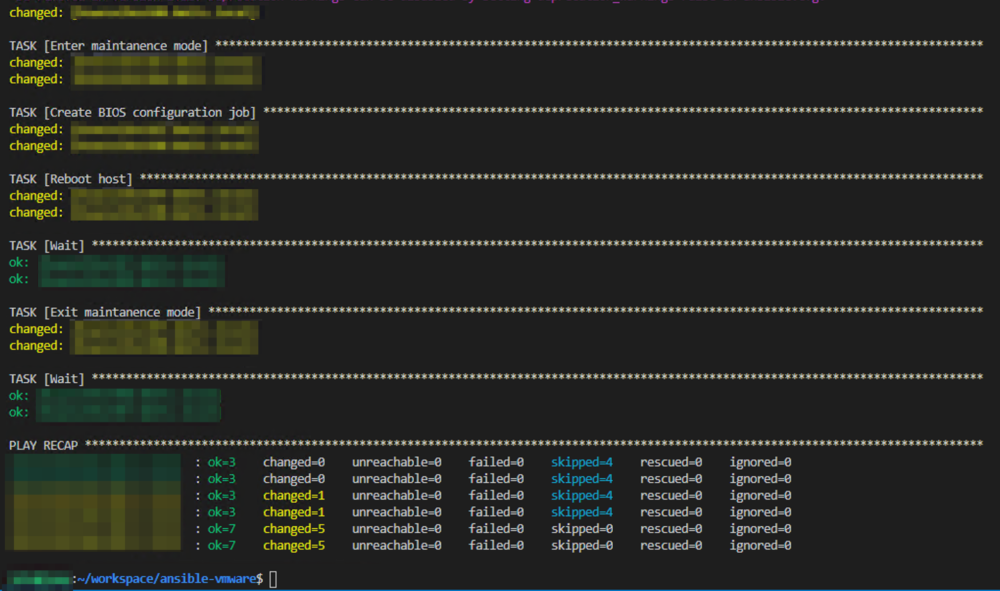

Recently, I found a configuration issue on a VMware cluster running on DellEMC hardware. Initially, they were vulnerable to the L1 Terminal Fault CVE-2018-3646, to mitigate we disabled HT in the BIOS of the hosts. As time passed, VMware released software updates to mitigate these issues. We did install the patches, but the disabled HT stayed the same. When the problem came to light, I decided to put Ansible to work as I did not want to perform manual work on the entire cluster. So the adventure begins! 

First, if you're on an affected CPU architecture, Intel Skylake in our case, you need to verify that you've implemented the Side-Channel-Aware Scheduler in VMware. I'm not going to go into detail in this post, so please read more at https://kb.vmware.com/s/article/55806.

Secondly, you need Ansible installed and also the OpenManage Ansible Modules and the OpenManage Python SDK. I will not invent the wheel for this as jonamiki.com has got an excellent blog post about the entire procedure http://jonamiki.com/2020/02/18/ansible-with-dell-poweredge-servers/.

Let's get down to it. 

Some things to notice in the play, it's executed in a rolling fashion and takes two hosts at a time, set the hosts into maintenance mode, applies the change, reboots and takes out of maintenance mode. Also, if no changes are made to the BIOS, the play will continue without rebooting the host. The reason for the reboot is that the BIOS changes are only applied upon reboot.

You need to bring your variables into the play, I will not post mine here, but if you are somewhat familiar with Ansible you will figure it out. 

One word of caution, I did not find a pretty way of confirming the host was online in vCenter after the reboot, so I just decided to wait 20 minutes and assume the host was online again. As I monitored the entire process, for me, this was not an issue. 

```ansible
---
- hosts: vmware
  connection: local
  name: Enable HT
  gather_facts: False
  serial: 2

  tasks:
  - name: Enable HT in BIOS
    redfish_config:
        category: Systems
        command: SetBiosAttributes
        bios_attributes:
            LogicalProc: "Enabled"
        baseuri: "{{ idrac_ip }}"
        username: "{{ idrac_username }}"
        password: "{{ idrac_password }}"
    register: ht
    
  - name: Enter maintanence mode
    vmware_maintenancemode:
      hostname: "{{ vcenter_hostname }}"
      username: "{{ vcenter_username }}"
      password: "{{ vcenter_password }}"
      esxi_hostname: "{{ inventory_hostname }}"
      validate_certs: False
      state: present
    when: ht.changed

  - name: Create BIOS configuration job
    idrac_redfish_command:
        category: Systems
        command: CreateBiosConfigJob
        baseuri: "{{ idrac_ip }}"
        username: "{{ idrac_username }}"
        password: "{{ idrac_password }}"
    when: ht.changed

  - name: Reboot host
    vmware_host_powerstate:
        hostname: '{{ vcenter_hostname }}'
        username: '{{ vcenter_username }}'
        password: '{{ vcenter_password }}'
        validate_certs: no
        esxi_hostname: "{{ inventory_hostname }}"
        state: reboot-host
    register: reboot_host
    when: ht.changed

  - name: Wait
    wait_for:
        timeout: 1200
    when: reboot_host.changed


  - name: Exit maintanence mode
    vmware_maintenancemode:
      hostname: "{{ vcenter_hostname }}"
      username: "{{ vcenter_username }}"
      password: "{{ vcenter_password }}"
      esxi_hostname: "{{ inventory_hostname }}"
      validate_certs: False
      state: absent

  - name: Wait
    wait_for:
        timeout: 30
```


