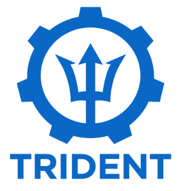
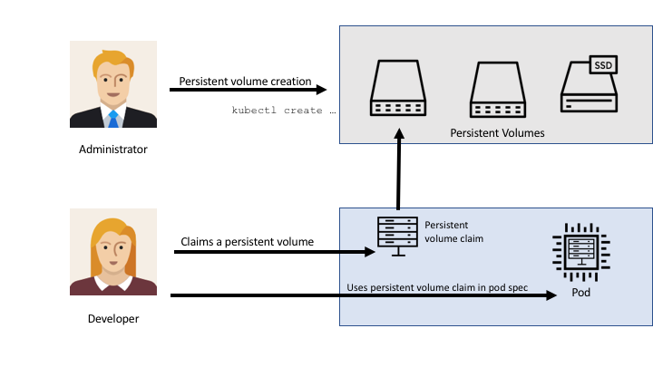
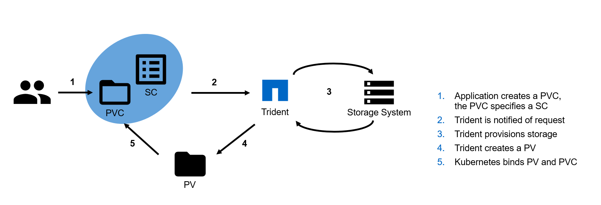

We all know Kubernetes is winning the container orchestration battle. We've seen a shift in application development and operations. Historically, software vendors shipped .EXE files to customers, small and large. The update cycle meant a new .EXE release every 6-12 months, or something similar. 

Now, the reality is that more and more software vendors turn to containers as shipping their products. Containers provide the ability to re-create the application regardless of the environment, both in development and production. No more need to install the correct dependencies on each development machine and production environment; just run docker, and you're ready to go. 

All and well, but both you and I know that containers are stateless. The idea with Kubernetes is to spin up as many pods as you need and if one dies, caused by node failure or anything else, k8s spins up a brand new one, and the old one remains dead.

Many organizations approach Kubernetes with the idea that everything stateful lives outside the realm of Kubernetes. Often in traditional VMs in VMware, things like databases, file repositories, and different application backends. 

But, why build silos when persistence is a well-functioning feature in Kubernetes?! Many storage providers hook into the Kubernetes API as CSI's to provide persistent storage. Even if the node dies and brings the pods with it, the CSI plugin will keep the storage persistent, and when a new pod spins up, the persistent volume (PV) will attach to the fresh container/pod. 

Persistence in Kubernetes also enables the traditional IT-department to be a part of the application development team (DevOps!!) process.

In this blog post, I'll specifically talk about the NetApp CSI called Trident, and I'll show you some benefits of persistent storage in Kubernetes.

Ok, so you may know NetApp from before, or you're this is the first time, regardless, Trident is powerful when it comes to persistent storage in k8s. Hell, NetApp is the king of storage irrespective of the application!

## What is Trident?
Trident is fully open-source and maintained by NetApp. Even if Trident currently works only with NetApp backends, you could, in theory, extend the project to support other backends.  

In short, Trident is the middle man when the developer requests a volume that should persist in container failure. Storage administrators specify what storage should be available to the developer (Storage Class, SC), and the developer then requests that storage as a volume (Persistent Volume Claim, PVC). 

Why should you go that extra mile to use NetApp storage with Trident instead of just spinning up an NFS-server to handle the storage? Well, NetApp has very compelling features when it comes to managing data.

Just a shortlist of features that add real value to your application environment. 
* Instantly clone volumes
* Resize volume in production
* Snapshot the volume
* Import volumes (great for DR and portability!)
* Cloud Volumes support (deploy Trident in GKE and leverage NetApp Cloud Volumes in GCP)

Besides that, the underlying NetApp storage adds efficiency features to save money, security features like encryption at rest, and a lot more! Talk to your infrastructure team; they know all of these features by heart.

## Where do I find more information on Trident?

* **GitHub Repository:** https://github.com/NetApp/trident
* **Trident Documentation:** https://netapp-trident.readthedocs.io/en/stable-v19.01/index.html
* **Using Trident with Kubernetes and ONTAP Lab:** https://labondemand.netapp.com/lab/sl10556 
* **Trident on thePub:** https://netapp.io/persistent-storage-provisioner-for-kubernetes/

### Nigel Poulton shows how to deploy GKE with Trident and Cloud Volumes
`youtube: https://youtu.be/KxUeyaASQVc`