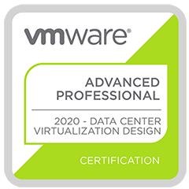

In the year 2019(it feels like a million years ago, right?!), I started my VMware Certification journey. In short, I passed my first VCP6, renewed it to 2019, and passed the VMware Cloud Provider Specialist exam. After a successful 2019, I went on parental leave from November to February. Now, when I'm back in action, I need to continue expanding my knowledge and have new goals to achieve in 2020. At first, I thought about going after the AZ-103 exam because some of my colleagues are going down the Azure route, but, as I'm already a VCP, I think it's wrong not to continue to the advanced certifications. I will start with the VCAP6.5-DCV design, and when I'm successful, I'll continue with the deploy exam. In this post, I'll share some of my study notes and links to the resources I use to prepare myself.

Ok, so let us dive in. The design exam verifies that people in the industry understand and can practice VMware architectural principles.  I'll start by explaining the two most essential pieces in architecture, RAMPS, and RCAR'. I'll also touch on NFR's and FR's. If these abbreviations make no sense to you, read on, and I'll explain.

# RAMPS and RCAR's 
So, these two go hand in hand. You could say that each topic in RAMPS maps to an RCAR. Let's say you have a requirement that dictates that you need to manage all the storage arrays from one centralized console. That requirement fits into the Manageability of RAMPS. Likewise, if you identify one or more risks in the design, you could map them to either of the RAMPS categories. 

# RAMPS
Let's start! I'll cover RAMPS first then we'll continue with RCAR's.

## R = Requirement
The requirements of the design dictate what the result will be. These are must-haves in the design.

*"The solution needs to accommodate 150 concurrent VDI users."*

While we're talking about requirements, I'll mention NFR's and FR's, more precisely Non-Functional Requirements and Functional Requirements. 

### Functional Requirement
These requirements are more of the "hard" kind. They describe what the solution **must be able to** deliver. They are specific and often relate to regulations and compliance. 

*"The design needs to meet the requirements of HIPAA."*

### Non-Functional Requirement
The NFR's are softer. They are more general and describe how the solution **should behave**. Often they describe the performance metrics that the solution should achieve.

*"We need sub-millisecond latency on the storage array."*

## C = Constraint
Constraints limit your design choice. The difference between a constraint and a requirement is that the constraint is limiting and prevents us from choosing a design that also could fill the requirements.

*"We need to maintain our relationship with NetApp. You will use NetApp arrays in the solution."*

## A = Assumption
Assumptions are something we trust to be true, but we don't have confirmation that it's true.  The goal is to keep assumptions to zero at the end of the design phase.

*"The co-location racks have sufficient cooling and power."*

# RCAR
Ok, so let's continue sorting out the business of RCAR's

## R = Risk
Risks may prevent you from achieving the result. Risks may not be obvious when the project starts, but it's important to discover all of the risks and mitigate them accordingly.  The goal is to mitigate all the risks.

The RCAR's are rather self-explanatory, but I'll summarize them for you.

## R = Recoverability
Recoverability means you need to think about how to recover from a disaster. Some things you need to think about are the RTO(Recovery Time Objective) and the RPO(Recovery Point Objective), in short, they dictate how much downtime and how far back in time you need to go in case of recovery from disaster. 

## A = Availability
Availability means that your solution needs to be available, the are different levels of availability often dictated by SLA's(Service Level Agreements). The SLA's are defined in nines, ex: 99,99% uptime. You need to take out the calculator and calculate the downtime allowed in minutes each month/year. To keep the solution available, you should look into redundancy, capacity & performance.

## M = Manageability
Manageability describes how you manage the solution. The buzzword often used in manageability is "single pane of glass." Often the customer wants to have easy management of the installed solution. But, also, the management often needs to be secure, trackable, and responsive.   

## S = Security
Maybe the most self-explanatory of all the RCARs. Security requirements dictate how secure your environment should be. Security risks mean something is not properly set up, and you risk to have availability issues or something like data theft. 

