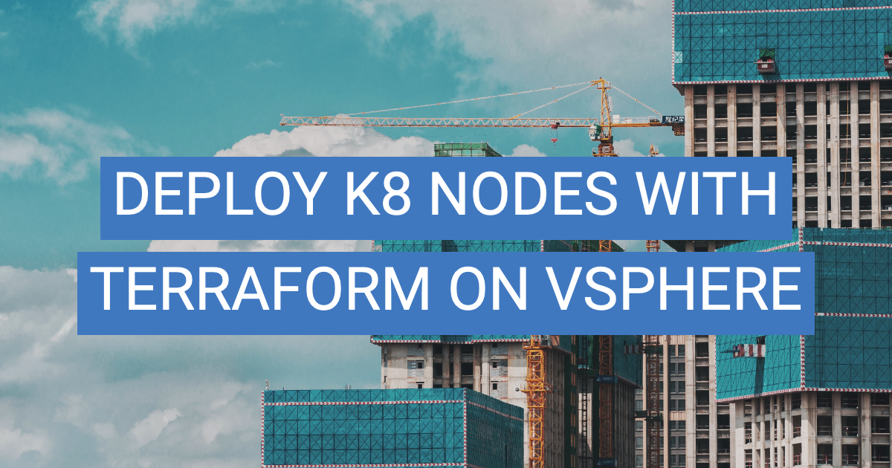
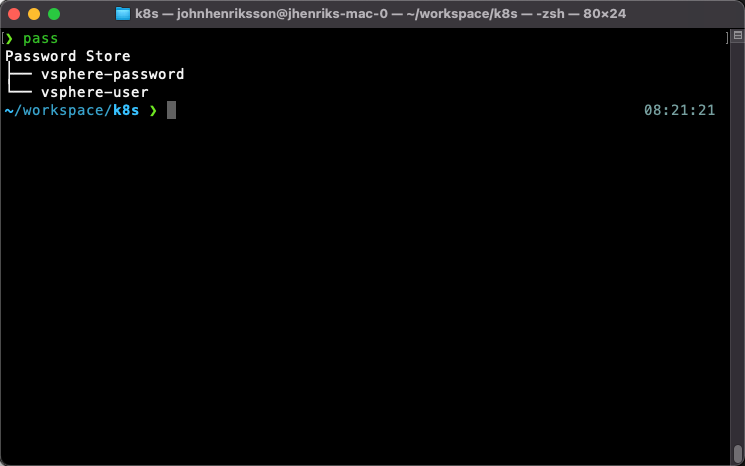
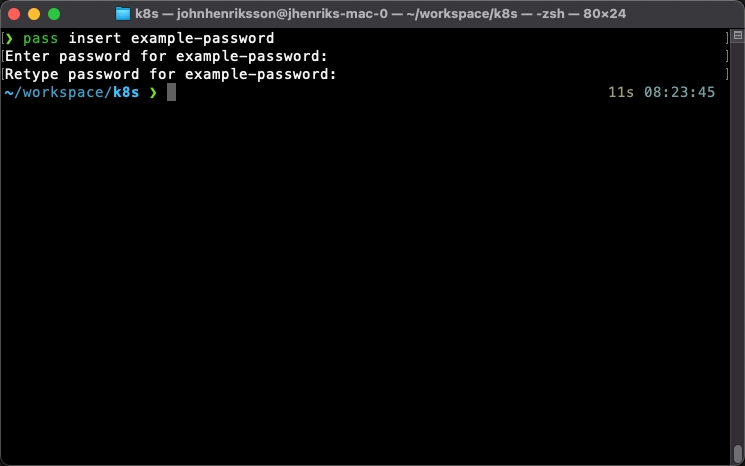
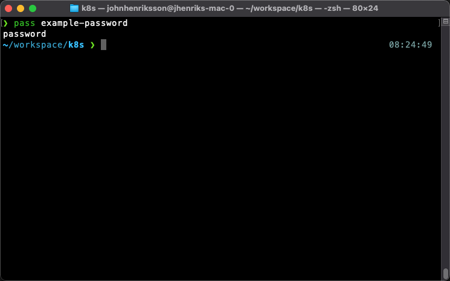

I'm on my way to deploying Kubernetes the hard way, following [Kelsey Hightowers GitHub tutorial](https://github.com/kelseyhightower/kubernetes-the-hard-way). The guide uses GCP for compute resources, but I want to utilize my home lab based on VMware, and I want to do it in a cloud fashion, with Infrastructure as Code. For this, I leverage tools like Packer and Terraform. In my previous post, I showed you how to build a VM template on vSphere with Packer. In this post, I'll show you how to provision VMs from that template with Terraform.

The mission is to deploy three controller nodes and three worker nodes, a total of 6 VMs. All these VMs should be full clones of my Ubuntu template. I want to create a folder in vSphere called k8s and put all the VMs in it. Also, I want Terraform to give me the IP addresses of the VMs so I can easily connect and continue configuration.

**So, what I need from Terraform is;**
* VM folder named k8s
* Controller nodes, k8s-controller-1, k8s-controller-2, k8s-controller-3
* Worker nodes, k8s-worker-1, k8s-worker-2, k8s-worker-3
* IP address output of each VM

I'll use my Ubuntu 20.04 template built with Packer as the base for these VMs. If you haven't read [my previous post](https://virtjo.com/2020/build-ubuntu-vm-with-packer-on-vsphere/), please do so now. 

The prepared template already has SSH keys, user accounts, settings, and so on set up. I highly recommend you set up your template as it makes things ALOT easier! When I need to rebuild my lab, I can generate a new VM within minutes, and everything is ready to connect once provisioned.

**Important Note**; You need to disable cloud-init in the template. To achieve this, add a shell provisioner to the build file with a local script file.

```json
"provisioners": [{
  "type": "shell",
  "script": "post-script.sh"
  }
]
```

Then create the script file as below. Besides disabling cloud-init, I've added the fix for the VMware customizations issue [KB56409](https://kb.vmware.com/s/article/56409). This issue's symptoms are network-related; vSphere fails to connect the network adapter without the hotfix.


```bash
#!/bin/bash

# Fix VMware Customization Issues KB56409
sudo sed -i '/^\[Unit\]/a After=dbus.service' /lib/systemd/system/open-vm-tools.service
sudo awk 'NR==11 {$0="#D /tmp 1777 root root -"} 1' /usr/lib/tmpfiles.d/tmp.conf | sudo tee /usr/lib/tmpfiles.d/tmp.conf

# Disable Cloud Init
sudo touch /etc/cloud/cloud-init.disabled
```

# Manage secrets with Pass
It's always a challenge on how to manage credentials and other secrets when doing Infrastructure as Code. I need to protect my username and password when checking in to a code repo such as GitHub. If I check in the secrets in clear-text, anyone with access to the repo can exploit my credentials. 

As I'm a single user, I've chosen the local password manager Pass. With this tool, each password lives in a gpg encrypted file.

Install Pass on Mac with homebrew `brew install pass`. If you need more info on how to install Pass, please visit the website [passwordstore.org](https://www.passwordstore.org)

With Pass, we can view the password file hierarchy:


And we can insert a new password:


We can show passwords


## Use Pass in Terraform Configuration

We'll use environment variables to set Terraform configuration variables. The environment variables need to be in the format `TF_VAR_name`, and Terraform will automatically pick it up.

In the configuration of Terraform, we declare the variables `vsphereuser` and `vspherepass`. To utilize Pass, we need to export the environment variable like this;

```bash
export TF_VAR_vsphereuser=$(pass vsphere-user)
export TF_VAR_vspherepass=$(pass vsphere-password)
```

# Terraform

We're all set with a Ubuntu 20.04 template, and our passwords are safe in the password manager. Let us move over to the fun part, create the Terraform configuration!

A Terraform project is any directory that contains `tf` files and has been initialized using the `init` command, which sets up Terraform caches and default local state.

We need a couple of files to get Terraform to do as we want, all these files uses the Hashicorp Configuration Language called HCL.
### main.tf
This file contains the main configuration, and it's here that you configure what resources and outputs you expect from Terraform.
```hcl
# Create VM Folder
resource "vsphere_folder" "folder" {
  path          = "k8s"
  type          = "vm"
  datacenter_id = data.vsphere_datacenter.dc.id
}
````

### variables.tf
This file declares the variables used in the project.
```hcl
variable "example" {}
```
### terraform.tfvars
This file automatically loads variables with defined values.
```hcl
example = "example value"
```

## Terraform CLI Commands
Once you have all the configuration set up and it's time to execute, you need to be aware of Terraform's different commands. I'll walk you through the most commonly used ones.

The workflow of Terraform is to plan, then apply. You can use the plan in a CI/CD pipeline with applicable change management processes suitable for your organization. As the plan output clearly shows what changes you intend to make, it's a powerful Terraform feature.

The workflow is like this;

```bash
terraform plan -out changes
terraform apply changes
terraform destroy
```

### Plan
The `terraform plan` command utilizes the Terraform configuration files, compares the configuration with the current state, and shows you the changes needed to achieve the declared state. It does not perform any changes. It just presents a plan for making changes.

It's possible to create a run file with the `terraform plan -out` command to be used with `terraform apply`. 

Let's say you create a run file with `terraform plan -out my-changes` you can quickly inspect the proposed changes with `terraform show my-changes`.
### Apply
The `terraform apply` command applies the changes required to reach the desired state of the configuration or the run file from the `terraform plan` command described above.


### Destroy
The `terraform destroy` command destroys the current infrastructure managed by Terraform. 

## Terraform Configuration

So, we're ready to start deploying infrastructure. Below you'll find the complete Terraform configuration. I'll walk you through the most critical parts.

### Configure vSphere Provider

Here we describe that the provider to be used in deploying our VMs in vSphere. Be sure to set `allow_unverified_ssl = true` if you're using self-signed certs.

```hcl
# Configure the vSphere provider
provider "vsphere" {
    user = var.vsphereuser
    password = var.vspherepass
    vsphere_server = var.vsphere-vcenter
    allow_unverified_ssl = var.vsphere-unverified-ssl
}
```
### Collect information needed to deploy VM resources
We use data sources to collect data for use later in the configuration. For example, we fetch a cluster resource for later use. Maybe we have multiple clusters, and we need to define the one where we want to deploy.

```hcl
data "vsphere_compute_cluster" "cluster" {
    name = var.vsphere-cluster
    datacenter_id = data.vsphere_datacenter.dc.id
}
```

### Deploy VM Resources

OK, so here's where the magic happens. Resources are the most crucial part of the configuration. Resources represent infrastructure objects such as VMs or virtual networks.

In this block, we describe three controller nodes to deploy. We use `count.index` to number the resources created. Besides configuring name, CPU, RAM, we also specify to clone the template we created with Packer. Inside the `clone` block, we have the `customize` block that leverages VMware Tools to customize the VM template with the hostname, network configuration, and DNS server.

To deploy worker nodes, we copy and paste this block and create a worker resource block.

```hcl
resource "vsphere_virtual_machine" "control" {
    count = var.control-count
    name = "${var.vm-prefix}-controller-${count.index + 1}"
    resource_pool_id = data.vsphere_compute_cluster.cluster.resource_pool_id
    datastore_id = data.vsphere_datastore.datastore.id
    folder = vsphere_folder.folder.path
    
    num_cpus = var.vm-cpu
    memory = var.vm-ram
    guest_id = var.vm-guest-id

    
    network_interface {
        network_id = data.vsphere_network.network.id
    }

    disk {
        label = "${var.vm-prefix}-${count.index + 1}-disk"
        size  = 25
    }

    clone {
        template_uuid = data.vsphere_virtual_machine.template.id
        customize {
            timeout = 0
            
            linux_options {
            host_name = "${var.vm-prefix}-controller-${count.index + 1}"
            domain = var.vm-domain
            }
            
            network_interface {
            ipv4_address = "10.128.128.11${count.index + 1}"
            ipv4_netmask = 24
            }

            ipv4_gateway = "10.128.128.1"
            dns_server_list = [ "10.128.128.80" ]

        }
    }
}
```

### Output IP addresses

Terraform Output is used to print information to the console. It's also possible to use output data in other Terraform modules.

```hcl
output "control_ip_addresses" {
 value = vsphere_virtual_machine.control.*.default_ip_address
}
```

## Running Terraform
In this short video I show you the steps to run the configuration decribed in this blog post, please enjoy! :) 

`youtube: https://www.youtube.com/watch?v=WjjCpUhBjXQ`


## Complete Configuration Files
### main.tf
```hcl
# main.tf

# Configure the vSphere provider
provider "vsphere" {
    user = var.vsphereuser
    password = var.vspherepass
    vsphere_server = var.vsphere-vcenter
    allow_unverified_ssl = var.vsphere-unverified-ssl
}

data "vsphere_datacenter" "dc" {
    name = var.vsphere-datacenter
}

data "vsphere_datastore" "datastore" {
    name = var.vm-datastore
    datacenter_id = data.vsphere_datacenter.dc.id
}

data "vsphere_compute_cluster" "cluster" {
    name = var.vsphere-cluster
    datacenter_id = data.vsphere_datacenter.dc.id
}

data "vsphere_network" "network" {
    name = var.vm-network
    datacenter_id = data.vsphere_datacenter.dc.id
}

data "vsphere_virtual_machine" "template" {
    name = var.vm-template-name
    datacenter_id = data.vsphere_datacenter.dc.id
}

# Create VM Folder
resource "vsphere_folder" "folder" {
  path          = "k8s"
  type          = "vm"
  datacenter_id = data.vsphere_datacenter.dc.id
}

# Create Control VMs
resource "vsphere_virtual_machine" "control" {
    count = var.control-count
    name = "${var.vm-prefix}-controller-${count.index + 1}"
    resource_pool_id = data.vsphere_compute_cluster.cluster.resource_pool_id
    datastore_id = data.vsphere_datastore.datastore.id
    folder = vsphere_folder.folder.path
    
    num_cpus = var.vm-cpu
    memory = var.vm-ram
    guest_id = var.vm-guest-id

    
    network_interface {
        network_id = data.vsphere_network.network.id
    }

    disk {
        label = "${var.vm-prefix}-${count.index + 1}-disk"
        size  = 25
    }

    clone {
        template_uuid = data.vsphere_virtual_machine.template.id
        customize {
            timeout = 0
            
            linux_options {
            host_name = "${var.vm-prefix}-controller-${count.index + 1}"
            domain = var.vm-domain
            }
            
            network_interface {
            ipv4_address = "10.128.128.11${count.index + 1}"
            ipv4_netmask = 24
            }

            ipv4_gateway = "10.128.128.1"
            dns_server_list = [ "10.128.128.80" ]

        }
    }
}

# Create Worker VMs
resource "vsphere_virtual_machine" "worker" {
    count = var.worker-count
    name = "${var.vm-prefix}-worker-${count.index + 1}"
    resource_pool_id = data.vsphere_compute_cluster.cluster.resource_pool_id
    datastore_id = data.vsphere_datastore.datastore.id
    folder = vsphere_folder.folder.path
    
    num_cpus = var.vm-cpu
    memory = var.vm-ram
    guest_id = var.vm-guest-id
    
    network_interface {
        network_id = data.vsphere_network.network.id
    }

    disk {
        label = "${var.vm-prefix}-${count.index + 1}-disk"
        size  = 25
    }

    clone {
        template_uuid = data.vsphere_virtual_machine.template.id
        customize {
            timeout = 0
            
            linux_options {
            host_name = "${var.vm-prefix}-worker-${count.index + 1}"
            domain = var.vm-domain
            }
            
            network_interface {
            ipv4_address = "10.128.128.12${count.index + 1}"
            ipv4_netmask = 24
            }

            ipv4_gateway = "10.128.128.1"
            dns_server_list = [ "10.128.128.80" ]
        }
    }
}

output "control_ip_addresses" {
 value = vsphere_virtual_machine.control.*.default_ip_address
}

output "worker_ip_addresses" {
 value = vsphere_virtual_machine.worker.*.default_ip_address
}
```

### terraform.tfvars
```hcl
# terraform.tfvars

# First we define how many controller nodes and worker nodes we want to deploy
control-count = "3"
worker-count = "3"

# VM Configuration
vm-prefix = "k8s"
vm-template-name = "ubnt-packer"
vm-cpu = "2"
vm-ram = "4096"
vm-guest-id = "ubuntu64Guest"
vm-datastore = "NVME"
vm-network = "VLAN128"
vm-domain = "virtjo.local"

# vSphere configuration
vsphere-vcenter = "vcsa.virtjo.local"
vsphere-unverified-ssl = "true"
vsphere-datacenter = "SDDC"
vsphere-cluster = "cluster01"

# vSphere username defined in environment variable
# export TF_VAR_vsphereuser=$(pass vsphere-user)

# vSphere password defined in environment variable
# export TF_VAR_vspherepass=$(pass vsphere-password)
```

### variables.tf
```hcl
# variables.tf
# Declare all the variables needed
variable "vsphereuser" {
    type = string
}
variable "vspherepass" {
    type = string
}
variable "vsphere-vcenter" {
    type = string
}
variable "vsphere-unverified-ssl" {
    type = string
}
variable "vsphere-datacenter" {
    type = string
}
variable "vsphere-cluster" {
    type = string
    default = ""
}
variable "control-count" {
    type = string
    description = "Number of Control VM's"
    default     =  3
}
variable "worker-count" {
    type = string
    description = "Number of Worker VM's"
    default     =  3
}
variable "vm-datastore" {
    type = string
}
variable "vm-network" {
    type = string
}
variable "vm-cpu" {
    type = string
    default = "2"
}
variable "vm-ram" {
    type = string
}
variable "vm-prefix" {
    type = string
}
variable "vm-guest-id" {
    type = string
}
variable "vm-template-name" {
    type = string
}
variable "vm-domain" {
    type = string
}
```

