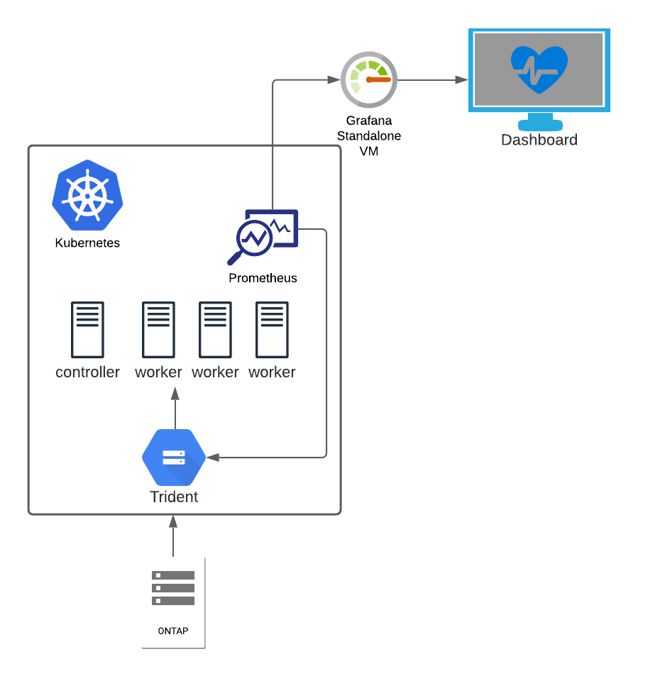
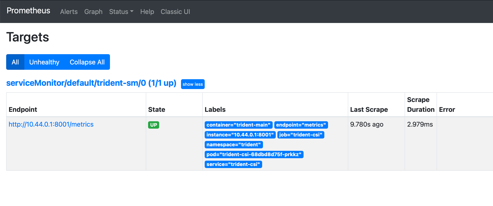
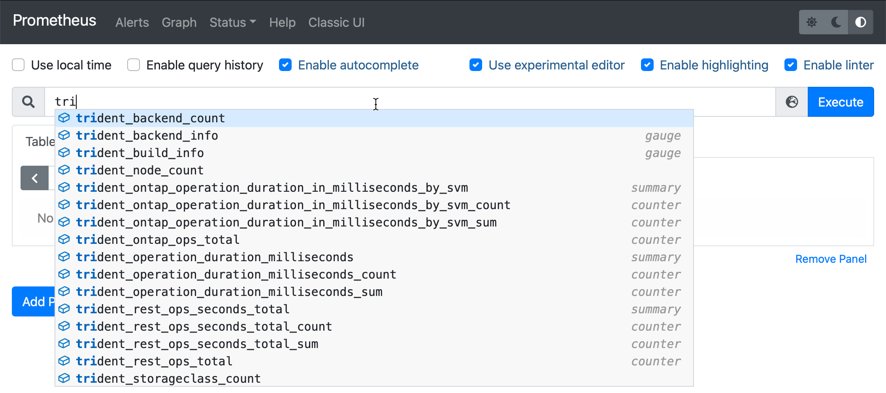
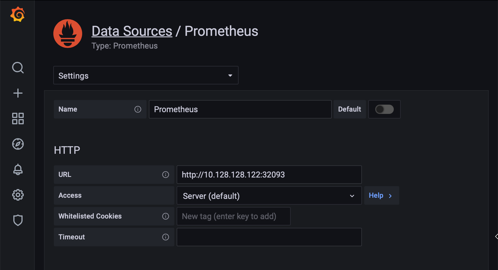
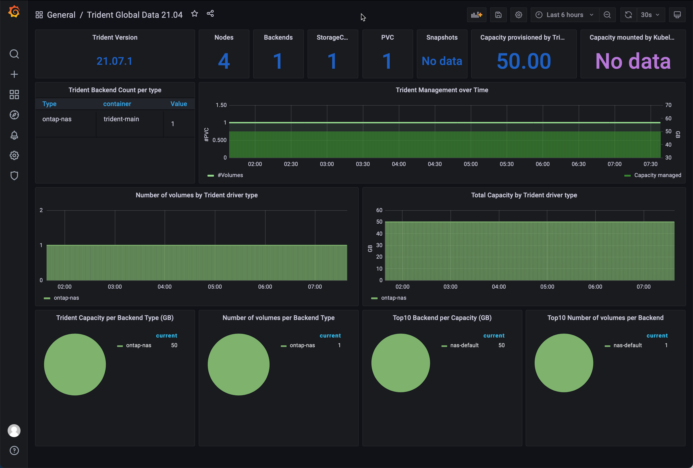

Trident provides Prometheus metrics endpoints that you can use to monitor Trident, its performance, and understand your environment. In this blog, we'll deep dive into how to install and configure Prometheus to monitor Trident.

I've set up my Kubernetes cluster with kubeadm, and it consists of four nodes, one master node, and three worker nodes. As Kubernetes has no built-in storage, I've deployed the software-defined version of NetApp ONTAP called ONTAP Select. I've deployed the CSI-compliant storage orchestrator, Trident. I will not go into detail on setting up K8s or Trident in this post.

This diagram presents the environment we're working with.



The goal of this post is to set up a Grafana dashboard monitoring my storage solution in Kubernetes.

State of my Kubernetes cluster. As you see, I have all the nodes configured and installed with Kubernetes v1.20.2. Also, I have trident version 21.07.1 deployed.

```bash
❯ k get nodes
NAME        STATUS  ROLES         AGE  VERSION
k8s-controller-1  Ready  control-plane,master  204d  v1.20.2
k8s-worker-1    Ready  <none>         204d  v1.20.2
k8s-worker-2    Ready  <none>         204d  v1.20.2
k8s-worker-3    Ready  <none>         204d  v1.20.2
```

```bash
❯ k get tver -n trident
NAME   VERSION
trident  21.07.1
```

What we need to do now is to deploy Prometheus on the cluster, leverage the ServiceMonitor CRD that watches the trident metrics and feeds back to Prometheus. Lastly, we hook up the Prometheus instance to my Grafana server. Easy peasy, right?! No worries, I'll help you get it running.

# Prometheus Operator

I know some people deploy the whole monitoring stack on Kubernetes, with both Grafana and Prometheus. I guess it's because it's easy to deploy. However, with a background in ITOps, it goes against my belief in deploying the monitoring stack on top of the kit you monitor. So, as I already have a standalone Grafana stack in my lab, I will just run Prometheus in k8s and hook that instance up to my Grafana server.

Let's get going and start the installation of the Prometheus Operator.

The Prometheus Operator is software that helps install and configure Prometheus instances on the Kubernetes cluster. You also get access to Custom Resource Definitions such as the ServiceMonitor that we need to monitor Trident. The operator allows you to easily set up multiple Prometheus instances, one for each application if you like. Thus, everything is streamlined and automated.

Let's clone the GitHub repo and install the operator on the cluster.
```bash
❯ git clone https://github.com/prometheus-operator/prometheus-operator.git
❯ cd prometheus-operator
❯ k apply -f bundle.YAML
customresourcedefinition.apiextensions.k8s.io/alertmanagerconfigs.monitoring.coreos.com created
customresourcedefinition.apiextensions.k8s.io/alertmanagers.monitoring.coreos.com created
customresourcedefinition.apiextensions.k8s.io/podmonitors.monitoring.coreos.com created
customresourcedefinition.apiextensions.k8s.io/probes.monitoring.coreos.com created
customresourcedefinition.apiextensions.k8s.io/prometheuses.monitoring.coreos.com created
customresourcedefinition.apiextensions.k8s.io/prometheusrules.monitoring.coreos.com created
customresourcedefinition.apiextensions.k8s.io/servicemonitors.monitoring.coreos.com created
customresourcedefinition.apiextensions.k8s.io/thanosrulers.monitoring.coreos.com created
clusterrolebinding.rbac.authorization.k8s.io/prometheus-operator created
clusterrole.rbac.authorization.k8s.io/prometheus-operator created
deployment.apps/prometheus-operator created
serviceaccount/prometheus-operator created
service/prometheus-operator created
```

As you see in the terminal output, we get a lot of custom resource definitions deployed. CRD's are essential, as, without them, we would not be able to deploy the ServiceMonitor we need, and we would get an error message like this one `no matches for kind "ServiceMonitor in version "monitoring.coreos.com/v1"`.

# Trident Metrics

I said earlier that Trident exposes Prometheus metrics. To elaborate, Trident reveals these metrics on a specific port called *metrics*. First, let's have a look at the Trident service.

```bash
❯ k describe svc -n trident -l app=controller.csi.trident.netapp.io
Name:              trident-csi
Namespace:         trident
Labels:            app=controller.csi.trident.netapp.io
                   k8s_version=v1.20.2
                   trident_version=v21.07.1
Annotations:       <none>
Selector:          app=controller.csi.trident.netapp.io
Type:              ClusterIP
IP:                10.108.176.147
Port:              https  34571/TCP
TargetPort:        8443/TCP
Endpoints:         10.44.0.1:8443
Port:              metrics  9220/TCP
TargetPort:        8001/TCP
Endpoints:         10.44.0.1:8001
Session Affinity:  None
Events:            <none>
```

As you see, we have a Trident service that exposes several ports, and we can quickly identify the one of interest for us, *metrics*. **It's of importance that we always reference this port by its name, not the port number. That's how Prometheus works**.

We can leverage curl to verify these metrics, but as the service is type ClusterIP and only internal to k8s, we need to use the port-forward command.

```bash
❯ k port-forward service/trident-csi -n trident :metrics
Forwarding from 127.0.0.1:59666 -> 8001
Forwarding from [::1]:59666 -> 8001
Handling connection for 59666
```

When the port-forward is running, open another terminal window and query the local port with curl.

```bash
❯ curl -s localhost:59666 | grep trident_backend_count
# HELP trident_backend_count The total number of backends
# TYPE trident_backend_count gauge
trident_backend_count{backend_state="online",backend_type="ontap-nas"} 1
```

# Set up Prometheus

Ok, so we have installed the Prometheus Operator, and we have access to Trident metrics. Now we need to deploy a Prometheus instance, ServiceMonitor CRD, other dependencies, and connect everything.

So a list of what we need to deploy:
* Serice Account to run Prometheus
* ClusterRole & ClusterRoleBinding
* Prometheus Instance
* Prometheus Service (NodePort)
* Trident ServiceMonitor

I'll walk through each part, but I've put all the resources in a single file named **prom.yaml**.

## ServiceAccount

First, let's look at the ServiceAccount, nothing fancy, but it needs to be there.

```yaml
---
apiVersion: v1
kind: ServiceAccount
metadata:
  name: prometheus-standalone
```

## ClusterRole

We need to create a role for the Prometheus service account. You'll find the required permissions in this file.

```yaml
---
apiVersion: rbac.authorization.k8s.io/v1
kind: ClusterRole
metadata:
  name: prometheus-standalone
rules:
- apiGroups: [""]
  resources:
  - services
  - endpoints
  - pods
  verbs: ["get", "list", "watch"]
- apiGroups: [""]
  resources:
  - configmaps
  verbs: ["get"]
- nonResourceURLs: ["/metrics"]
  verbs: ["get"]

```

## ClusterRoleBinding

Use ClusterRoleBinding to tie together the ServiceAccount and the ClusterRole.

```yaml
---
apiVersion: rbac.authorization.k8s.io/v1
kind: ClusterRoleBinding
metadata:
  name: prometheus-standalone
roleRef:
  apiGroup: rbac.authorization.k8s.io
  kind: ClusterRole
  name: prometheus-standalone
subjects:
- kind: ServiceAccount
  name: prometheus-standalone
  namespace: default
```

## Prometheus Instance

With this snippet, we leverage the Prometheus Operator to deploy an instance of Prometheus wherever we want it. This way, you can embed the Prometheus instance with the application however you prefer. 

Note that we tell the Prometheus Operator what version we want to deploy, and also we define how ServiceMonitors will be picked up. This is done with the `ServiceMonitorSelector`. For example, I want to pick up the ServiceMonitor labeled as `app: trident` - nothing else in this deployment.

```yaml
---
apiVersion: monitoring.coreos.com/v1
kind: Prometheus
metadata:
  name: prometheus-standalone
  labels:
    prometheus: k8s
spec:
  replicas: 1
  version: v2.29.2
  serviceAccountName: prometheus-standalone
  serviceMonitorSelector:
    matchLabels:
      app: trident
```

## Prometheus Service

Once we have Prometheus up and running, I want to expose the Prometheus port to connect it to my standalone Grafana server. As I don't have any load balancer deployed in my lab, I will use the service type of NodePort.

With this service, Prometheus is exposed on port 9090 on all my nodes.

```yaml
---
apiVersion: v1
kind: Service
metadata:
  creationTimestamp: null
  labels:
    app: prometheus
  name: prometheus-prometheus-standalone-0
spec:
  ports:
  - port: 9090
    protocol: TCP
    targetPort: 9090
  selector:
    app: prometheus
    app.kubernetes.io/instance: prometheus-standalone
    app.kubernetes.io/managed-by: prometheus-operator
    app.kubernetes.io/name: prometheus
    app.kubernetes.io/version: 2.29.2
    controller-revision-hash: prometheus-prometheus-standalone-5999b488c
    operator.prometheus.io/name: prometheus-standalone
    operator.prometheus.io/shard: "0"
    prometheus: prometheus-standalone
    statefulset.kubernetes.io/pod-name: prometheus-prometheus-standalone-0
  type: NodePort
status:
  loadBalancer: {}
```

## Trident ServiceMonitor

We need the ServiceMonitor that feeds back metrics to Prometheus. Note in this file that we specify the label `app: trident` so Prometheus picks it up as we've previously configured.

```yaml
---
apiVersion: monitoring.coreos.com/v1
kind: ServiceMonitor
metadata:
  name: trident-sm
  labels:
    app: trident
spec:
  jobLabel: trident
  selector:
    matchLabels:
      app: controller.csi.trident.netapp.io
  namespaceSelector:
    matchNames:
    - trident
  endpoints:
  - port: metrics
    interval: 15s
```

# Deploy and Configure

We got everything prepared, all the YAML is written, we're coffeed up and ready to go! 

I've concatenated everything but the ServiceMonitor to one file. This makes everything easy and smooth to deploy.

`prom.yaml` contains everything but the ServiceMonitor.

```bash
❯ tree .
.
├── prom.yaml
└── sm-trident-prom.yaml

0 directories, 2 files
```

## Deploy Prometheus on the cluster

First, apply the `prom.yaml` file. I put everything in the default namespace just because I can.. 

```bash
❯ k apply -f prom.yaml
serviceaccount/prometheus-standalone created
clusterrole.rbac.authorization.k8s.io/prometheus-standalone created
clusterrolebinding.rbac.authorization.k8s.io/prometheus-standalone created
prometheus.monitoring.coreos.com/prometheus-standalone created
service/prometheus-prometheus-standalone-0 created
```

We quickly see everything we defined now being created on the cluster. To verify, we can query the Prometheus resources.

```bash
❯ k get prometheus
NAME                    VERSION   REPLICAS   AGE
prometheus-standalone   v2.29.2   1          2m57s
```

## Deploy the Trident ServiceMonitor

Now, we have a Prometheus instance on the cluster. But for now, it's empty, as we configured the `ServiceMonitorSelector` parameter to look for the label `app: trident`, and we have no ServiceMonitors with that label.

Deploy the `sm-trident-prom. yaml` file on the cluster.

```bash
❯ k apply -f sm-trident-prom.yaml
servicemonitor.monitoring.coreos.com/trident-sm created
```

```bash
❯ k get servicemonitor
NAME         AGE
trident-sm   23s
```

We've successfully created the ServiceMonitor resource on the cluster.

## Verify Prometheus and Trident ServiceMonitor

Everything is deployed, and Kubernetes once again showed its power of automation and agility, Isn't it nice to request something in a file, apply, and it's just there? Much easier than a traditional installation/configuration. 

We must verify that everything works this far. It'll make our lives easier when we move over to the next step of connecting Grafana to Prometheus.

In the configuration, we defined a NodePort service for Prometheus. We can use this to log in to the Prometheus web interface.

```bash
❯ k get svc prometheus-prometheus-standalone-0
NAME                                 TYPE       CLUSTER-IP      EXTERNAL-IP   PORT(S)          AGE
prometheus-prometheus-standalone-0   NodePort   10.111.214.23   <none>        9090:32093/TCP   12m
```

We need to connect to the `32093` port of one of our nodes. But, first, let's find out what IP our nodes have.

```bash
❯ kubectl get nodes -o yaml | grep -- "- address:"
    - address: 10.128.128.111
    - address: k8s-controller-1
    - address: 10.128.128.121
    - address: k8s-worker-1
    - address: 10.128.128.122
    - address: k8s-worker-2
    - address: 10.128.128.123
    - address: k8s-worker-3
```

I'll choose one of my workers, `http://10.128.128.122:32093`.

Head over to `Status -> Targets` and you'll find the ServiceMonitor dicovered by Prometheus.



If we go to the Graph page and type in **tri**, we get Trident's metrics. This way, we know everything is working.



## Configure Grafana

I've already set up my Grafana instance on a standalone VM outside of my k8s cluster. So this is not a guide on installing Grafana. Instead, in this post, I'll show you how to hook it up to monitor Trident.

Open Grafana go to `Configuration -> Data Sources` and add a Prometheus data source. Define the URL that we used earlier `http://10.128.128.122:32093`. That's about it. Now we have integration between Grafana and Prometheus.

**If you intend to run this setup in production, you need to think about security, secure communication between Grafana and Prometheus, and restrict access.**



### Add a Dashboard

You'll want a friendly dashboard to overview your Trident environment quickly. This dashboard can be used to set up a TV in a NOC, or in your living room for that matter!

I've not created any dashboards myself. I recommend using the ready built examples from Yves Weisser. You find them on his [github](https://github.com/YvosOnTheHub/LabNetApp/tree/master/Kubernetes_v4/Scenarios/Scenario03/3_Grafana/Dashboards).

In this example, I use the dashboard `Trident_Dashboard_21.04.json`.



My environment is quite dull as I have just one backend and one PVC with no snapshots. However, as you add backends, volumes, and snapshots, that'll all reflect the dashboard, and you get an excellent overview of what's going on with storage in your Kubernetes environment.

# Resources

* [Yves github repo](https://github.com/YvosOnTheHub/LabNetApp/tree/master/Kubernetes_v4/Scenarios/Scenario03) have helped me alot in setting this up.
* Kudos to the [Prometheus Operator project on github](https://github.com/prometheus-operator/prometheus-operator) that's behind all the magic in this setup.
* [NetApp documentation on how to monitor Trident.](https://netapp-trident.readthedocs.io/en/stable-v21.07/kubernetes/operations/tasks/monitoring.html?highlight=monitor)
* Want to learn more about Trident? Head over to [netapp.io](https://netapp.io/persistent-storage-provisioner-for-kubernetes/)


**I hope you've enjoyed this blog post, leave a comment down below on how you liked it!**