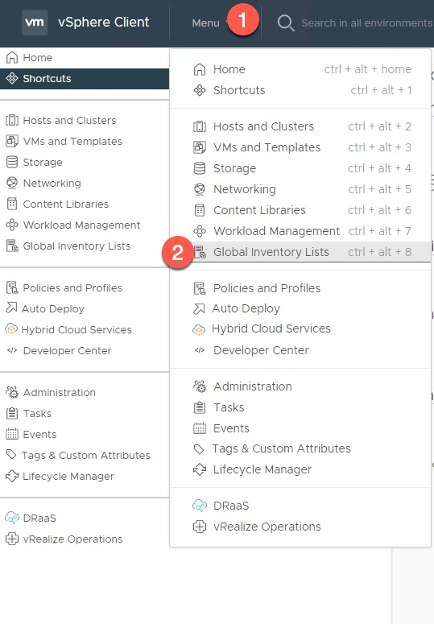

This was a new discovery for me! Maybe everyone already knows about the ONTAP Select vCenter Plug-in - but for me, it's a new acquaintance. With the plug-in, you quickly deploy and manage ONTAP clusters on your VMware environment, all from vCenter. 

Let us start with what ONTAP Select is and go through the architecture of the ONTAP Select deployment process. 

## What is ONTAP Select?
ONTAP Select is the software-defined version of NetApp's storage operating system ONTAP. Essentially it's the same operating system that runs in the appliances AFF & FAS. With ONTAP Select, you can choose to deploy it on custom hardware, KVM, or VMware.

You can find ONTAP Select on the NetApp support site. Login to your NetApp SSO account on https://mysupport.netapp.com and navigate to the ONTAP Select download page.

## ONTAP Select Deploy VM
When we look closer into how ONTAP Select **(OTS for short)** works, we quickly discover that OTS uses a deployment VM to provision storage node VM's to the ESXi cluster. OTS Deploy VM provides automation of installation and provisioning on these storage nodes. As an administrator, you simply fill out a web form wizard, and OTS Deploy takes care of the rest. 

## ONTAP Select vCenter Plug-In
The vCenter plug-in is packaged with the OTS Deploy VM. When you're done installing OTS Deploy VM, the next step is to provision the vCenter plug-ing from OTS Deploy. You can have multiple vCenter servers in one Deploy VM, but you can only install one instance of the plug-in at each vCenter server.

## Deploy vCenter Plug-in
Let's dive into the fun stuff! 

First, you need to deploy the ONTAP Select Deploy OVA - I'll not cover that in this post, so please ensure you have that done before going ahead with these steps. 

**When you have OTS Deploy installed, go ahead and log in to the web interface.**

**Navigate to the pane where you register vCenter servers - Administration -> Management Servers -> Add vCenter**

**Add the details of the vCenter server connection and add the vCenter server**

**You'll see a message of successful provisioning of the vCenter server**
    

**Furthermore, in vCenter UI, you clearly see the plug-in deployed**

**Let's navigate to the Global Inventory List to view our new ONTAP Select Plug-in**

**In the right pane, you see the ONTAP Select Clusters**

**Now that we're in the vCenter Plug-in, we're able to deploy new storage clusters directly from this view. Let's click the New ONTAP Select button to deploy a new OTS instance**

**This is the same view as the wizard in the native OTS Deploy VM - so let's add the details of our new OTS workload cluster**

**You need to specify which host you want to deploy to, as well as VLAN's and storage pool capacity**

**Enter the desired OTS admin password and click Create Cluster to begin the automated deployment**

**We clearly see that the new OTS cluster create operation is initialized**

**We also see the newly created cluster in the vCenter Plugin-in view**

**In vCenter, we see that the cluster is initializing**

**When we navigate to the OTS Deploy VM, we see the same view as in vCenter**

**Once the cluster create operation is completed, we see that the OTS node turns green in the vCenter view, and everything is done. Click on the button at the right to launch System Manager**

**That brings us directly to the System Manager of the deployed ONTAP Select cluster. Let's log in and have a look**

**Once logged in, we see that OTS is just the same ONTAP that we're used to managing, just that it runs on top of VMware instead of on an appliance from NetApp**

**Likewise, in the ONTAP Select Deploy VM, we see that the cluster create operation is completed**
