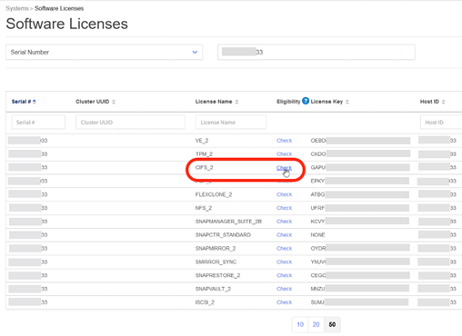
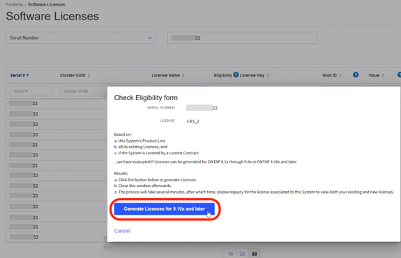
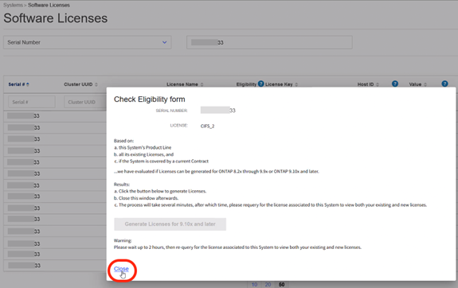
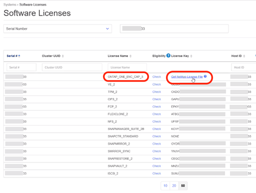
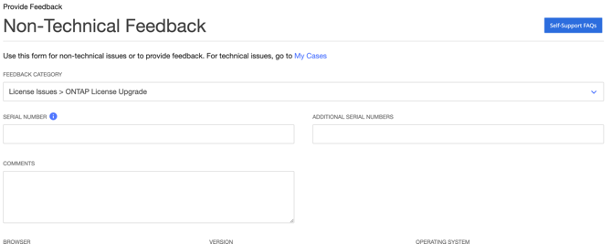
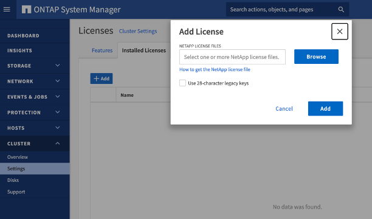

In early 2023 NetApp released the new licensing model ONTAP One which made it possible for everyone with active support to get use of premium-priced features such as SnapLock and Anti Ransomware. In this post, I will cover how you download and enable the new license on your system

The license change is non-disruptive and you can enable the new unlocked features in a safe manner when you wish.

# Step 1, pre-reqs

Before you start you need;
* **Serial number of the nodes to upgrade**
* **Make sure you have active support and purchased some premium bundle** to be able to upgrade to ONTAP One. If you have only the core bundle you will get the ONTAP  Base which includes only the base funcitonallity and not the extended features like ARP & SnapLock.
    * If you do not have purchased a premium bundle you can purchase the ONTAP One compability package - reach out to your NetApp sales rep.
    * Review the table below to find what new license you're entitled to.

| ONTAP Software Bundle on System | New Software suite being matched | Additional Keys entitled |
| ---                            | ---                              | ---                      |
| Core                           | ONTAP Base                       | NVMeoF                   |
| Base                           | ONTAP Base                       | NVMeoF, FlexClone, S3, SnapRestore |
| Core + Data Protection, Flash, Premium | ONTAP One                       | NVMeoF, ARP, MTKM, SnapLock, SnapMirror Cloud, S3 SnapMirror |
| Core + S&C                     | ONTAP Base                       | NVMeoF                   |

* **NVMeoF** – Enables the NVMeoF protocol for front end client IO, both NVMe/FC and NVMe/TCP
* **FlexClone** – Enables rapid creation of space efficient cloning of data based on snapshots
* **S3** – Enables the S3 protocol for front end client IO
* **SnapRestore** – Enables rapid recovery of data from snapshots
* **ARP** – Autonomous Ransomware Protection, enables the automatic protection of NAS file shares
when abnormal filesystem activity is detected
* **MTKM** – Multi Tenant Key Manager, enables the ability to have multiple key managers for different
tenants on the system
* **SnapLock** – Enables the protection of data from modification, deletion or corruption on the system
* **SnapMirror Cloud** – Enables the replication of system volumes to object targets
* **S3 SnapMirror** – Enables the replication of ONTAP S3 objects to alternate S3 compatible targets

## Generate the new license

Login to https://mysupport.netapp.com, click on Systems menu, choose Software Licenses and search by System Serial Number. Locate your CIFS_2 license and click on Check link in the Eligibility column

*The Check Eligibility form dialog box will appear*

Click on the Generate Licenses for 9.10.x and later button

The conversion process will take some time to complete, so click on Close to close the dialog box

After 2 hours, return to the Software Licenses page and query using your System Serial Number.

*The ONTAP One license associated to your system should be available*

Click on the Get NetApp License File link and then follow the prompts to email or save your NLF.

**Note: If you encounter any issues during the procedure, open a non-technical case for further assistance on https://.netapp.com/site/help**

## Activate the new license in ONTAP

1. Select Cluster > Settings.
2. Under Licenses, select arrow icon.
3. Select Browse. Choose the NetApp License File you downloaded.

### Read more
**ONTAP 9.10.1 and later licensing overview** https://kb.netapp.com/onprem/ontap/os/ONTAP_9.10.1_and_later_licensing_overview 

**How to get an ONTAP One license when the system has NLFs already** https://kb.netapp.com/onprem/ontap/os/How_to_get_an_ONTAP_One_license_when_the_system_has_NLFs_already