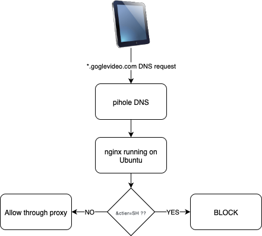
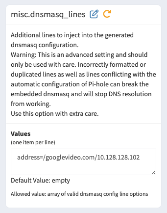
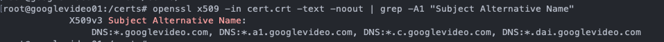
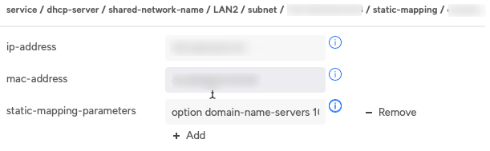

YouTube Shorts is an annoying, addictive video service that my kids love. I've been looking for a way to disable just the shorts feature as they are allowed to view "classic videos". In my search I stumbled upon this guide, which I've extended on https://dealancer.medium.com/blocking-youyube-shorts-with-nginx-and-nextdns-c2ccb0ff5452 

What I learned is that the requests to YouTube have the parameter **&ctier=SH** so you need to intersect the traffic to YouTube and block these specific request, while allowing the rest.

In my setup I use pihole as DNS server and I use a CA certificate to sign the Nginx certificate on a seperate Ubuntu server. I need a CA as that is the only way to get the trust to iPhone/iPad.

The flow looks something like this:


# Pi-hole configuration
First, I needed my DNS server to in a wildcard manner redirect *.googlevideos.com to my nginx server at 10.128.128.102

This is done through dnsmasq and if you go to Settings -> All Settings -> Miscellaneous -> misc.dnsmasq_lines and you add the line as below.

This way *.googlevideo.com will be redirected to 10.128.128.102

```bash
address=/googlevideo.com/10.128.128.102
```



# Set up certificates and nginx proxy on Ubuntu

First step done, now it's time to move on to the ngnix server, hosted on Ubuntu 22.04.

We need SSL certificates as we will do a SSL proxy. I will generate a CA certificate and then sign the certificate needed for nginx, this as iPhones won't accept to import and trust a standalone self-signed certificate.

First you need to install openssl

```bash
sudo apt install openssl
```

We need a key for our CA

```bash
openssl genrsa -aes256 -out ca-key.pem 4096
```

Next step, create a certificate for our CA, **important to specify the days to 365** as Apple won't accept any CA beyond 1 year
```bash
openssl req -new -x509 -sha256 -days 365 -key ca-key.pem -out ca.pem
```

**The ca.pem file is the one you need to install in the trusted root store on your clients**


Time to create the cert needed for the nginx service, let's start with the key file used for the cert
```bash
openssl genrsa -out cert-key.pem 4096
```

Now we create the cert sign request
```bash
openssl req -subj "/CN=*.googlevideo.com" -sha256 -new -key cert-key.pem -out cert.csr
```

Once the request is created we create the file **san.cnf** to hold the certificate configuration
```bash
[ req ]
default_bits       = 2048
distinguished_name = req_distinguished_name
req_extensions     = req_ext
x509_extensions    = v3_req
prompt             = no

[ req_distinguished_name ]
CN = *.googlevideo.com

[ req_ext ]
subjectAltName = @alt_names

[ v3_req ]
subjectAltName = @alt_names

[ alt_names ]
DNS.1 = *.googlevideo.com
DNS.2 = *.a1.googlevideo.com
DNS.3 = *.c.googlevideo.com
DNS.4 = *.dai.googlevideo.com
```

Now we have everything to generate a CA signed certificate
```bash
openssl x509 -req -sha256 -days 365 \
  -in cert.csr \
  -CA ca.pem -CAkey ca-key.pem \
  -CAcreateserial \
  -out cert.crt \
  -extfile san.cnf -extensions v3_req
```

You can verify the cert with the below command

```bash
openssl x509 -in cert.crt -text -noout | grep -A1 "Subject Alternative Name"
```


## Configure proxy

Now it's time to configure the nginx web proxy

To install nginx do
```bash
apt update
apt install nginx
```

Add this to /etc/nginx/nginx.conf - I've copied this from the excellent [guide mentioned at the start](https://dealancer.medium.com/blocking-youyube-shorts-with-nginx-and-nextdns-c2ccb0ff5452)
```bash
# Use DNS server to resolve IP address of a domain
resolver 8.8.8.8 8.8.4.4 valid=300s;
resolver_timeout 5s;

server {
        # Listeon on HTTPS
        listen 443 ssl http2;

        # Listen on any domain
        server_name _;

        # Use self signed certificates
        ssl_certificate /certs/mydomain.crt;
        ssl_certificate_key /certs/mydomain.key;

        location / {
                # Block YouTube shorts based on query parameter
                if ($arg_ctier = "SH") {
                        return 403;
                }

                # Proxy pass to the same domain
                set $backend_host $host;
                proxy_pass https://$backend_host$request_uri;
                proxy_set_header Host $host;
                proxy_set_header X-Real-IP $remote_addr;
                proxy_set_header X-Forwarded-For $proxy_add_x_forwarded_for;
                proxy_set_header X-Forwarded-Proto $scheme;
                proxy_ssl_server_name on;
                proxy_ssl_protocols TLSv1.2 TLSv1.3;
                proxy_ssl_ciphers HIGH:!aNULL:!MD5;
        }
}
```

Restart nginx to apply the configuration 
```bash
service nginx restart
```
# Conclusion

Now, every device using pihole as DNS will have YT shorts blocked.

Finally, I wanted only my kids devices to use pihole DNS, allowing me to control the traffic, both block unwanted sites through DNS lists and also redirect YouTube to my proxy.

What I've done is that I use Edgerouter X as router and in the DHCP configuration I edit optional parameters to the static mapping to leverage my pihole DNS for these clients.

Go to the config tree -> service -> DHCP-server -> shared-network-name -> (your network) -> subnet -> (your subnet) -> static mapping -> desired device

add this parameter to static-mapping-parameters where the IP would be your pihole server
```bash
option domain-name-servers 10.128.128.93;
```


Now your desired clients use pihole as DNS and will redirect the YouTube traffic to the nginx proxy