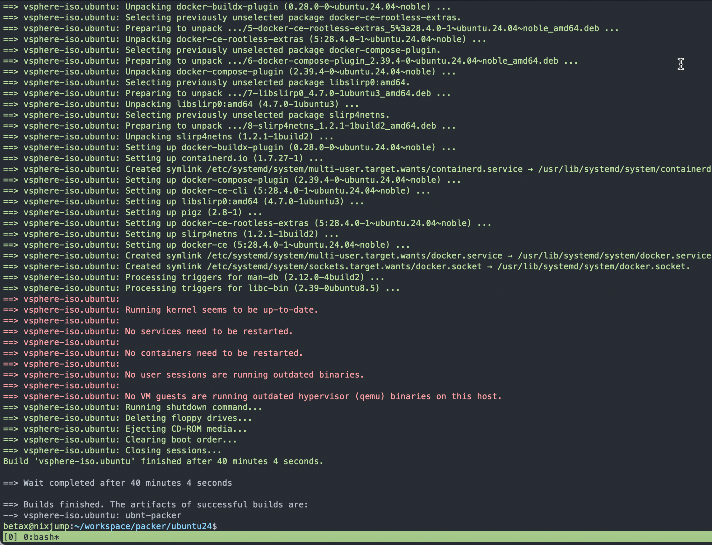
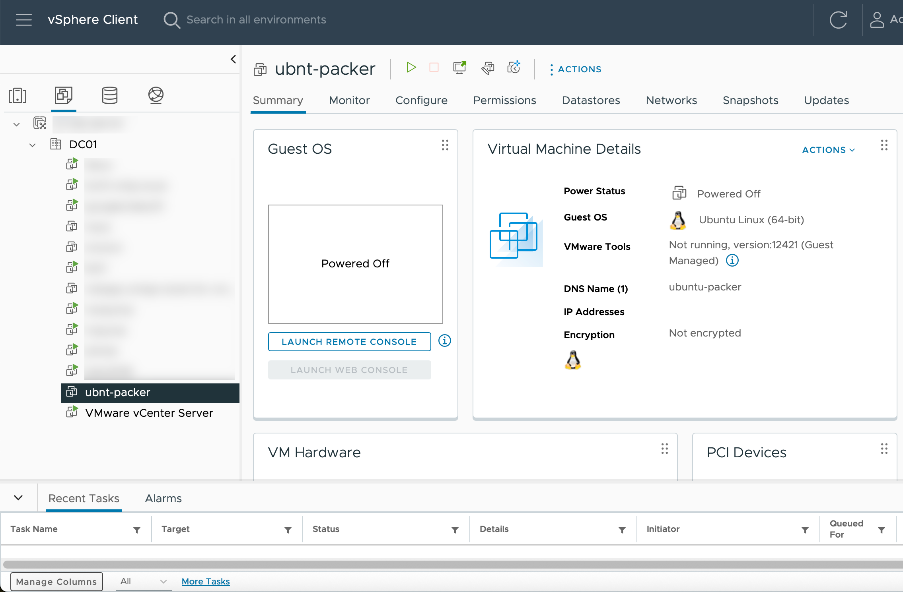

A couple of years ago I did a post on how to use Packer to build Ubuntu 20.04 VM on vSphere. You can find it [here](https://johnhenriksson.se/blog/2020/build-ubuntu-vm-with-packer-on-vsphere/). It go a lot of reads and now I've made an update focused on 24.04 and also changed from yaml to hcl code. I did this because I'm on a mission to move VM's from an old KVM host to vSphere, instead of using some shady migration tool I will rebuild the VM's and move the configuration files. I want to free the KVM host to install Proxmox instead, more on that in a later post.


# What is Packer?
Let's hear it from the source:

*Packer is a community tool for creating identical machine images for multiple platforms from a single source configuration. Packer is lightweight, runs on every major operating system, and is highly performant, creating machine images for multiple platforms in parallel. Packer does not replace configuration management like Chef or Puppet. In fact, when building images, Packer is able to use tools like Chef or Puppet to install software onto the image.*

[Introduction to Packer](https://developer.hashicorp.com/packer/docs/intro)

So basically, you can use Packer to build VM's from ISO's based on code. Infrastructure as code, just how we like it. Also, it's easy to implement in your CI/CD pipeline to go full hipster.

Packer builds the VM from the desired ISO and is also able to perform advanced provision tasks. Also, I'm able to inject my SSH public key to enable key-based authentication on the template.

I'll later use this VM template as a source when deploying infrastructure resources with Terraform, but more on that in another blog post.

# Install Packer

I will not go through the installation process in this blog. Please visit the getting started guide on packer.io if you need help installing. [You'll find it here.](https://developer.hashicorp.com/packer/tutorials/docker-get-started/get-started-install-cli)

# Create the Build
In my home lab, I'm now able to build a fresh template in ~12 minutes. That's pretty good!

You'll need these files. The `ubuntu.pkr.hcl` file is where you configure settings for Packer to build and provision the VM, connect to vSphere, and so on. The `ubuntu.auto.pkrvars.hcl` contains environment specific settings such as vCenter password, so keep it well guarded. The `user-data` and `meta-data` files are used for unattended installation of Ubuntu. Although only the user-data files contain information, both must be present. Packer uses these files and mounts them as CDROM's to the vSphere guest VM.

As a bonus I've added `docker-engine.sh`, a shell script to be used as a Packer provisioner to install docker engine on my template, as all my VM's use this to run containers.


```bash
❯ tree .
.
├── docker-engine.sh
├── http
│   ├── meta-data
│   └── user-data
├── ubuntu.auto.pkrvars.hcl
├── ubuntu.pkr.hcl
└── variables.pkr.hcl

2 directories, 6 files
```


Also, you'll need to upload an ISO to the vSphere datastore and edit the iso_url variable. I've uploaded the ISO to my datastore2 datastore, as you see here.

[Download Ubuntu Server ISO](https://ubuntu.com/download/server)

```hcl
#ubuntu.auto.pkrvars.hcl

iso_url = "[datastore2] ISO/ubuntu-24.04.3-live-server-amd64.iso"
```

## Important code snippets in the build file

### SSH Timeout

So, I had some trouble with Packer where it failed to connect to SSH. The issue is that SSH is present when Ubuntu performs the unattended installation, then Ubuntu reboots and performs the cloud-init part and configures my user. Packer thinks the VM is ready on the first SSH connectivity.

Be sure to add this snippet to workaround the issue.
```hcl
#ubuntu.pkr.hcl
ssh_timeout            = "60m"
ssh_handshake_attempts = 100
```

### Generate Password

You need to generate a password salted with SHA512. Unfortnaetly I faced some issues with my Mac where mkpasswd is not present. Well, docker to the rescue! The below command works fine to generate the password with the help of docker.

```bash
> docker run --rm -ti alpine:latest mkpasswd -m sha512
Password: 
$6$eZsKuZ3lwrfwvrJ3$FSmB.RPl9doTTe57fHDvbMjyu/wFZOcNfuGZ82id4ZZYbUZ0P9GP6ZWamYK3JZzwnMIjL1WEVczqHf03.IqYS/
```

### Configure Identity

Edit the user-data file with the newly created password.

```yaml
#user-data
identity:
  hostname: ubuntu-packer
  username: ubnt
  password: $6$RAVeOPg.9rJylcnK$tm6KVpRXxTGb0et.1PQcmLVCFLjIVaLye.Weiizxw3ecGRI2kA0JH7nFxkJCz4oeZphSO4qzYSwncE/s34UHg0
```

### SSH Settings

First, you'll need your SSH public key if you want to enable key-based authentication in your template.

```bash
❯ cat ~/.ssh/id_rsa.pub
ssh-rsa AAAAB3NzaC1yc2EAAAADAQABAAABAQCi9eAu6KBaShdcL4pxi6/sJp+IS6nCKexcjQdwFLxg+EoiT2MTAnMsjnfi570het+VV+iOigcZLuRwEcAPh6rSQOtpikmpV6WFjzToWq9aUxDrxWsp/iEPHp+sbjrlsdnGvLGY9XhmPs9s5I8xFQbwF6ilhMIQm+RxtGJJuPUWaF+uXo+3CB91A6bK/rjs97iAjrPZRs0vo5hJGqrIGFi3WP9hf8hF9oWz2BiLRYBib3il6lsAl4Ca0sI//gNM0Ztj4gB7qv1+uPz157bk0IZoN285/72l/rUZVSPIwO+QFZFK07FsyVrpAgMlHk65BiSAO4DtolZEArfXRE1g1DH/ mail@example.com
```

Secondly, inject the key in the user-data file.
```yaml
#user-data
ssh:
  install-server: yes
  allow-pw: true
  authorized-keys: 
    - ssh-rsa AAAAB3NzaC1yc2EAAAADAQABAAABAQCi9eAu6KBaShdcL4pxi6/sJp+IS6nCKexcjQdwFLxg+EoiT2MTAnMsjnfi570het+VV+iOigcZLuRwEcAPh6rSQOtpikmpV6WFjzToWq9aUxDrxWsp/iEPHp+sbjrlsdnGvLGY9XhmPs9s5I8xFQbwF6ilhMIQm+RxtGJJuPUWaF+uXo+3CB91A6bK/rjs97iAjrPZRs0vo5hJGqrIGFi3WP9hf8hF9oWz2BiLRYBib3il6lsAl4Ca0sI//gNM0Ztj4gB7qv1+uPz157bk0IZoN285/72l/rUZVSPIwO+QFZFK07FsyVrpAgMlHk65BiSAO4DtolZEArfXRE1g1DH/ mail@example.com
```

### Build

When you've created the required files and filled in all the variables, you're ready to build the VM. Use the below to start the build. If you're overwriting the VM with each iteration, use the -force flag.

```bash
❯ packer init .
❯ packer build -force .
```



When you're done, you'll find the template in vSphere ready for use!


# Required Files
**ubuntu.pkr.hcl**
```hcl
packer {
  required_plugins {
    vsphere = {
      source  = "github.com/hashicorp/vsphere"
      version = ">= 1.0.0"
    }
  }
}

source "vsphere-iso" "ubuntu" {
  # Point to your ESXi host here
  vcenter_server      = var.vsphere_server
  #host                = var.vsphere_server

  username            = var.vsphere_user
  password            = var.vsphere_password
  insecure_connection = true

  # Remove or comment these when using standalone ESXi
  datacenter = var.vsphere_datacenter
  cluster    = var.vsphere_cluster

  datastore           = var.vsphere_datastore
  guest_os_type       = "ubuntu64Guest"

  CPUs                = var.vm_cpu_num
  RAM                 = var.vm_mem_size
  RAM_reserve_all     = false

  # Must be a list for your plugin version
  disk_controller_type = ["pvscsi"]

  storage {
    disk_size             = var.vm_disk_size
    disk_thin_provisioned = true
  }

  network_adapters {
    network      = var.vsphere_network   # ESXi portgroup name
    network_card = "vmxnet3"
  }

  vm_name             = var.vm_name
  notes               = "Build via Packer"
  convert_to_template = false

  ssh_username           = "ubnt"
  ssh_password           = "ubnt"
  ssh_timeout            = "60m"
  ssh_handshake_attempts = 100


  iso_paths = [var.iso_url]

  cd_files = [
    "./http/user-data",
    "./http/meta-data",
  ]
  cd_label  = "cidata"
  boot_wait = "10s"

  boot_command = [
    "c", "<wait3s>",
    "linux /casper/vmlinuz autoinstall ds=nocloud;s=/cdrom/", "<enter><wait3s>",
    "initrd /casper/initrd", "<enter><wait3s>",
    "boot", "<enter>",
  ]

  shutdown_command = "echo 'ubnt'|sudo -S shutdown -P now"

}


build {
  sources = ["source.vsphere-iso.ubuntu"]
  provisioner "shell" {
    inline = [
      "echo set debconf to Noninteractive", 
      "echo 'debconf debconf/frontend select Noninteractive' | sudo debconf-set-selections" ]
  }
  provisioner "shell" {
    inline = [
      "sudo apt-get -y install util-linux-extra" ]
  }
  provisioner "shell" {
    script = "./docker-engine.sh"
    pause_before = "10s"
  }
}
```
**docker-engine.sh**
```bash
#docker-engine.sh

sleep 30

# Add Docker's official GPG key:
sudo apt-get update
sudo apt-get -y install ca-certificates curl
sudo install -m 0755 -d /etc/apt/keyrings
sudo curl -fsSL https://download.docker.com/linux/ubuntu/gpg -o /etc/apt/keyrings/docker.asc
sudo chmod a+r /etc/apt/keyrings/docker.asc

# Add the repository to Apt sources:
echo \
  "deb [arch=$(dpkg --print-architecture) signed-by=/etc/apt/keyrings/docker.asc] https://download.docker.com/linux/ubuntu \
  $(. /etc/os-release && echo "${UBUNTU_CODENAME:-$VERSION_CODENAME}") stable" | \
  sudo tee /etc/apt/sources.list.d/docker.list > /dev/null
sudo apt-get update

sudo apt-get -y install docker-ce docker-ce-cli containerd.io docker-buildx-plugin docker-compose-plugin
```
**ubuntu.auto.pkrvars.hcl**
```hcl
# WARNING: This file contains secrets. Don't commit it. Add to .gitignore. 🔒
vsphere_server     = "10.128.128.101"                   # vCenter address if using datacenter/cluster
vsphere_user       = "administrator@vsphere.local"
vsphere_password   = "supersecretpassword"
vsphere_datacenter = "Datacenter"
vsphere_cluster    = "Cluster"             # Must be the vSphere Cluster name or ESXi hostname

vsphere_network   = "VLAN128"
vsphere_datastore = "datastore2"

vm_name      = "ubnt-packer"
vm_cpu_num   = 1
vm_mem_size  = 1024
vm_disk_size = 25600

iso_url = "[datastore2] ISO/ubuntu-24.04.3-live-server-amd64.iso"
```

**variables.pkr.hcl**
```hcl
variable "vsphere_server" {
  type = string
}

variable "vsphere_user" {
  type = string
}

variable "vsphere_password" {
  type      = string
  sensitive = true
}

variable "vsphere_datacenter" {
  type = string
}

variable "vsphere_cluster" {
  type = string
}

variable "vsphere_network" {
  type = string
}

variable "vsphere_datastore" {
  type = string
}

variable "vm_name" {
  type = string
}

variable "vm_cpu_num" {
  type = number
}

variable "vm_mem_size" {
  type = number
}

variable "vm_disk_size" {
  type = number
}

variable "iso_url" {
  type = string
}
```
**user-data**
```yaml
#cloud-config
autoinstall:
  version: 1
  locale: en_US
  keyboard:
    layout: se
  storage:
    layout:
      name: lvm
  identity:
    hostname: ubuntu-packer
    username: ubnt
    password: $6$eZsKuZ3lwrfwvrJ3$FSmB.RPl9doTTe57fHDvbMjyu/wFZOcNfuGZ82id4ZZYbUZ0P9GP6ZWamYK3JZzwnMIjL1WEVczqHf03.IqYS/
  ssh:
    install-server: yes
    allow-pw: true
    authorized-keys: 
      - ssh-rsa AAAAB3NzaC1yc2EAAAADAQABAAABAQCi9eAu6KBaShdcL4pxi6/sJp+IS6nCKexcjQdwFLxg+EoiT2MTAnMsjnfi570het+VV+iOigcZLuRwEcAPh6rSQOtpikmpV6WFjzToWq9aUxDrxWsp/iEPHp+sbjrlsdnGvLGY9XhmPs9s5I8xFQbwF6ilhMIQm+RxtGJJuPUWaF+uXo+3CB91A6bK/rjs97iAjrPZRs0vo5hJGqrIGFi3WP9hf8hF9oWz2BiLRYBib3il6lsAl4Ca0sI//gNM0Ztj4gB7qv1+uPz157bk0IZoN285/72l/rUZVSPIwO+QFZFK07FsyVrpAgMlHk65BiSAO4DtolZEArfXRE1g1DH/ mail@example.com
  user-data:
    disable_root: false
  late-commands:
    - echo 'ubnt ALL=(ALL) NOPASSWD:ALL' > /target/etc/sudoers.d/ubuntu
```