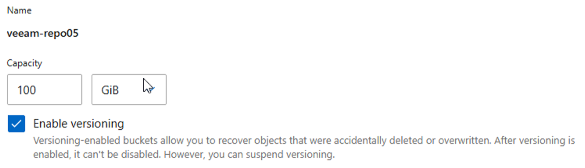
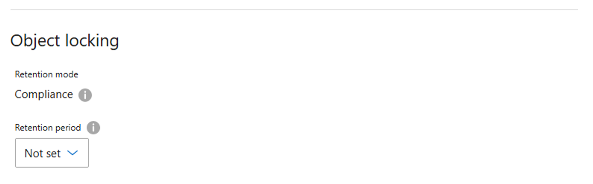
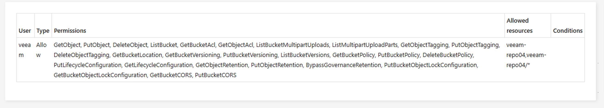
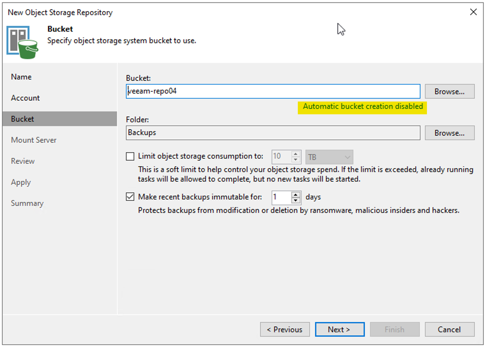
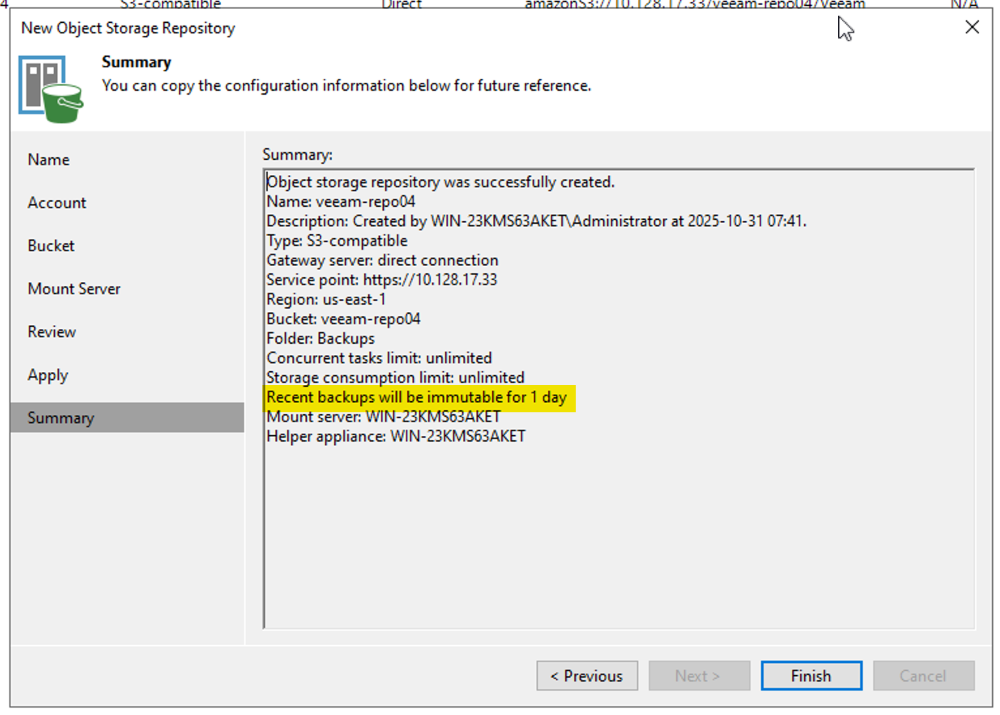

In this blog post I will go through how to use the NetApp ONTAP storage to enable Immutable S3 repository in Veeam.

I've tested this with **ONTAP 9.17.1** and Veeam **v12.3.2**

The basics steps to enable Immutable repository in Veeam with ONTAP S3 is

1. Create the bucket in System Manager
2. Enable Object lock & ensure all permissions on object lock are enabled for the user that access the bucket, I’ve noticed that after you enable object lock more permissions options are available.

3. Configure the bucket in Veeam, be sure to disable auto provisioning. 
4. The immutability is now managed from Veeam

## Create the bucket in ONTAP System Manager

Set the required size and be sure to enable versioning

Enable object lock, set the required mode, compliance in my case and set retention period to "Not Set" as this will be managed by Veeam

Be sure the user accessing the bucket from Veeam has all the required permissions to set object lock configuration

## Configure the bucket in Veeam

Create a new S3 compatible object storage repository in Veeam, enter the correct endpoint and credentials. You may have to import the certificate to the Veeam server if it's not trusted.

Enter the bucket name, browse the bucket and create the desired folder. **Be sure to disable automatic bucket creation.**

Configure the desired immutable retention, this can be changed at a later stage as well by editing the repo in Veeam.

Continue and create the repo and now the backups are immutable in ONTAP S3, managed by Veeam.

Here's a full video of the process that I've described in this blog post.


